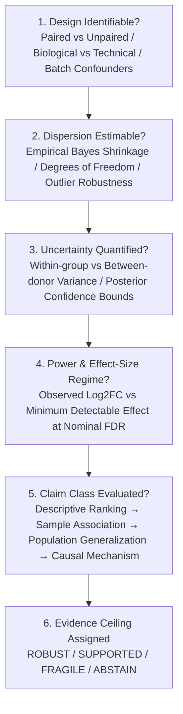
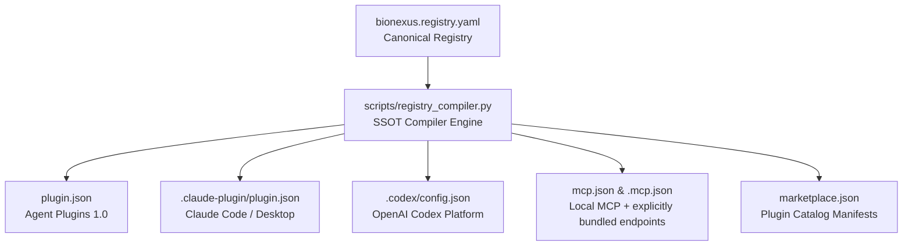

# BioNexus — Scientific Reliability for AI-Assisted Biology

<div align="center">

[](https://github.com/HERRY423/BioNexus/releases/tag/v1.0.0-rc.8)
[](https://www.python.org/)
[](LICENSE)
[](https://github.com/HERRY423/BioNexus/actions/workflows/ci.yml)
[](#-regulatory-notice--compliance)

*v1.0.0-rc.8: GA Closure Candidate (software/API closure, not scientific validation)*

</div>

> **Know what your evidence actually warrants.**

BioNexus is a warrant-first reliability layer between AI-assisted analysis and scientific claims.

Core 1.0's [supported surface and acceptance criteria](GA_CRITERIA.md) are frozen.
Support remains unactivated; [historical validation reports](docs/validation-history.md)
are kept separate from new execution evidence.

### Current first laboratory workflow:
**Start here: review multi-donor single-cell differential expression before submission.**

```bash
# Synthetic teaching example; no research data or analysis execution required.
bionexus audit-de --demo --bundle review-demo
```

**First product promise:** bring an existing DE table, sample sheet and intended
claim; receive located findings, missing evidence, suggested repairs and a concise
review for the responsible scientist. Keep your existing analysis workflow.

**首个产品承诺：多供体单细胞差异表达的投稿前影子审计。**
帮助研究者发现可能影响声明的问题，并记录复核与修复成本。
减少错误外推、节省审阅时间是试点要验证的目标，当前不宣称已验证净收益。

Open `review-demo/REVIEW.md`. Exit code 1 is expected: the example deliberately
lacks evidence. The report preserves that result. See the
[first review walkthrough](docs/quickstart-shadow-audit.md) and
[laboratory pilot guide](docs/de-pilot-guide.zh-CN.md).

On the current development checkout, run `bionexus audit-de-verify review-demo`: it checks report-file
consistency without authorizing scientific claims. See
[versioned bundle compatibility](docs/de-bundle-compatibility.md) and
[maintenance, support and rollback](MAINTENANCE.md).

The development checkout also provides [frozen external-task comparisons, full
laboratory time accounting and rule-revision impact review](docs/external-gain-and-correctable-governance.zh-CN.md).
These retain missing outcomes, false refusals, expert dissent and negative time savings;
they do not establish external validation or laboratory benefit.

---

## 🔬 Why scientists install it: warrant, not refusal

Not "the firewall is strict." This:

**Before BioNexus** — the agent runs it and overclaims:

```text

Request: "Run DE between these two clusters and identify condition-specific genes."

Agent:   Done. 2,341 cells vs 3,107 cells. 153 significant genes.

         -> Presented as a population-level condition effect.

```

**With BioNexus** — the same request is separated into what blocks and what limits:

```text

WARRANT: PERMITTED_WITH_LIMITS  (purpose=screening, ceiling=FRAGILE)

Epistemic Context Evaluation:

  Design Identifiability:  Unpaired, 2 donors/group (within-donor variance unestimated)

  Effect-Size Regime:      Polygenic moderate effect (requires dispersion shrinkage)

  Claim Requested:         'population-level treatment effect' (EXCEEDS EVIDENCE)

Verdict: Compute is fully PERMITTED, but CLAIM is capped to Cohort-Specific Descriptive.

What you CAN still do:   run pseudobulk DE, rank candidates, explore within-sample shifts.

What is BLOCKED:         'population-wide causal treatment effect' claim.

Override:                allowed (screening purpose) — researcher records why,

                         and FRAGILE ceiling + blocked claim are preserved.

Rule provenance: Squair et al. 2021 (Nature Comms); Lun & Marioni 2017; Soneson & Robinson 2018.

```

This is the product: telling you what the evidence warrants. A hard block fires only when an execution invariant is violated (garbage data, model masquerade, uncertified clinical claim) — otherwise BioNexus permits the compute and caps the claim.

---

## 🧭 Context-Conditioned Epistemic Ladder: Rejecting "Magic Number" Refusals

A common failure mode of automated validation systems is confusing empirical rules of thumb with universal scientific laws (e.g. dogmatic `$N < 3 \to \text{refuse}, N \ge 3 \to \text{valid}$`).

In real biological workflows, inferential validity is not a step function at an arbitrary sample size:

- **Design Identifiability**: A paired or isogenic design (e.g., treated vs control within the same 2 donors or cell lines) can legitimately identify strong candidate signals with low within-donor dispersion.

- **Effect-Size Regime**: A deterministic monogenic knockout ($\text{Log2FC} > 6, \text{FDR} < 10^{-15}$) requires far less replication to rule out technical noise than subtle polygenic shifts ($\text{Log2FC} = 0.3$).

- **Confounding vs Power**: Having $N=10$ donors with unmodeled batch confounding or extreme uncorrected dispersion does not justify population claims.

BioNexus structures rule enforcement around a 6-stage **Context-Conditioned Epistemic Ladder**:



### Community Governance: Scientific Rule Challenges & RFCs

Scientific consensus evolves as experimental modalities and statistical models advance. BioNexus provides an open, auditable governance loop:

- **Scientific Rule Catalog** ([`review/SCIENTIFIC_RULE_CATALOG.json`](review/SCIENTIFIC_RULE_CATALOG.json)): Explicitly documents the context conditions, uncertainty parameters, biological exceptions, and literature citations for every rule.

- **Rule Challenge Mechanism**: Researchers can submit formal **Scientific Rule Challenges** via GitHub Issues and Discussions to propose counterexamples, novel biological contexts, or updated empirical bounds.

---

## 🏗️ The Core Pillars of the Warrant Architecture

BioNexus was upgraded from *"when not to compute"* to *"what the evidence warrants"*. Six mechanisms make that real:

| Pillar | What it does | Key API |
|---|---|---|
| **1. Invariant vs Warrant** | Splits every rule into an **execution invariant** (safety/integrity — must block) or a **warrant constraint** (epistemic — caps the claim, never blocks legal compute). | `RuleCategory`, `RuleClassification` |
| **2. Evidence Model** | Evidence strength is assessed **only** from evidence facts (replication, sample design, confound controls, provenance…) — purpose decides the **requirement** the evidence must clear, never the evidence value: `exploratory` requires ≥ PRELIMINARY, `confirmatory` ≥ ROBUST, `clinical` ≥ REPLICATED + external validation. Unspecified purpose leaves sufficiency undecided — BioNexus does not assume exploratory for you. | `assess_evidence`, `evaluate_sufficiency`, `UseRequirement` |
| **3. Rule Provenance** | Every rule carries evidence-backed provenance (DOIs/URLs), a consensus level, and known exceptions — loaded from an auditable registry, not hardcoded opinion. | `RuleProvenance`, `load_rule_registry` |
| **4. Researcher Override** | Professionals may proceed past a soft warrant block, but must record *why*, what limits remain, and which claims still cannot be made. Hard invariants are never overridable. | `create_override_record`, `OverrideRecord` |
| **5. BCTK Diagnostic Kit** | Target-bound development diagnostics for third-party agents, plugins, workflows, and packages. Certification and badge issuance are suspended pending independent evidence. | `bctk test`, `bionexus conformance test`, `BNS-020` |
| **6. Evidence Debt Ledger** | Traces scientific shortcuts, uncalibrated thresholds, and domain mismatches across the claim DAG with heuristic debt remediation priority ranking. | `bionexus debt audit`, `bionexus debt payoff`, `BNS-021` |

The old binary `PERMITTED / REFUSED` is now a spectrum: `PERMITTED` · `PERMITTED_WITH_LIMITS` (soft blocks overridden) · `REFUSED` (hard invariant violated).

---

## 🛡️ BCTK — BioNexus Conformance Test Kit

Similar to the **OpenTelemetry (OTel) compliance ecosystem**, BioNexus explicitly distinguishes between *using BioNexus* and *being BioNexus-Conformant*:
BioNexus does **not** force researchers or agent developers to use BioNexus's internal code; rather, if any Agent, Plugin, Workflow, or Analysis Package claims **BioNexus Conformance**, it must machine-provably satisfy the **Scientific ABI v1** across 8 core dimensions.

```bash
# Test any plugin, skill, python module, or package:
bctk test my-plugin
# or
bionexus conformance test my-plugin
```

See the full [BCTK Developer Guide](docs/CONFORMANCE_TEST_KIT.md) and [BNS-020 Specification](spec/BNS-020-conformance-test-kit.md).

---

## 💳 Evidence Debt  — Project-Wide Reliability Accounting

In software engineering, teams manage **Technical Debt** rather than publishing an arbitrary *"Code Quality: 83%"*.

BioNexus introduces **Evidence Debt (BNS-021)** for computational biology and AI discovery:
Instead of a vanity score, BioNexus structures deferred verifications, heuristic shortcuts, uncalibrated thresholds, and domain mismatches across the project dependency DAG.

```text
Claim 17 (Target gene CD274 upregulated in Exhausted CD8+ T cells)
   ↓
Claim 12, Claim 7, Claim 4, Claim 1, Claim 19, Claim 20 (6 other claims)
   ↓
TRANSFORM-ANNOTATION-X (Heuristic gating on tumor infiltrate)
   ↓
Atlas Reference Domain Mismatch (PBMC reference)
```

### Remediation Priority Schedule & Epistemic Keystones:
Targeting `TRANSFORM-ANNOTATION-X` resolves a foundational keystone bottleneck affecting **7 downstream claims** (heuristic priority score: **70.0** = 7 claims × 10.0 critical severity weight), pinpointing high-leverage targets where targeted empirical validation will provide the broadest clarity across the claim DAG.

> **Transparency Note**: The priority score is an analytical triage heuristic (`|claims| × w_severity`) to prioritize verification order. It is **not** an empirical risk reduction measurement, does not model wet-lab experimental costs or success probabilities, and resolving an upstream dependency does not automatically upgrade downstream claim maturity without independent empirical evidence.

```bash
# Audit project evidence debt
bionexus debt audit .

# Compute heuristic remediation priority schedule ranked by claim impact × severity
bionexus debt payoff .

# Visual Mermaid dependency DAG
bionexus debt graph .
```

See the full [Evidence Debt Developer Guide](docs/EVIDENCE_DEBT.md) and [BNS-021 Specification](spec/BNS-021-evidence-debt.md).

---

## ⚖️ Evidence Model: Evidence Strength ≠ Intended Use Requirement

The deepest decoupling: **purpose decides the evidence requirement, never the evidence value.**
A study with 10 donors/group, pre-registration, adequate power, and an independent replication
carries ROBUST evidence whether the researcher calls it exploratory or confirmatory — and weak
data does not acquire a REPLICATED standing because someone declares a clinical purpose.
Three objects make this explicit:

| Object | Question | Depends on |

|---|---|---|

| `EvidenceAssessment` | How strong **is** the evidence? | Evidence facts only (declared factors + active violations). Purpose- and policy-independent. |

| `ClaimContext` | What does the researcher want to claim? | Claim class: descriptive → association → population effect → mechanistic → causal → clinical actionability. |

| `UseRequirement` | How much evidence does the intended use demand? | Purpose + claim class composed — the only place purpose enters. |

The verdict compares them — `evaluate_sufficiency` returns `WARRANTED`, `WARRANTED_WITH_LIMITS`

(documented ack; the bar never moves), or `NOT_SUFFICIENT_FOR_INTENDED_USE` with an explicit gap list:

```python

from bionexus import (

    assess_evidence, evaluate_sufficiency, ClaimClass, ClaimContext,

    PurposeContext, ResearchPurpose,

)

# Evidence is what it is, whatever the purpose:

evidence = assess_evidence(satisfied_factors=[

    "sample_design", "confound_controls", "sensitivity_analysis",

    "backend_fidelity", "provenance",

])  # -> ROBUST under every purpose

# ROBUST evidence + population-effect claim + confirmatory use -> WARRANTED

suff = evaluate_sufficiency(

    evidence=evidence,

    purpose_context=PurposeContext(purpose=ResearchPurpose.CONFIRMATORY),

    claim_context=ClaimContext(claim_class=ClaimClass.POPULATION_EFFECT),

)

# SufficiencyVerdict.WARRANTED

# SUPPORTED evidence + clinical use -> NOT_SUFFICIENT_FOR_INTENDED_USE

# (requires REPLICATED + external_validation + regulatory_context)

```

---

## 🏛️ Lab Policy Profiles: Shadow / Advisory / Enforced

BioNexus strictly separates two objects that must never be conflated:

```text

WarrantAssessment  (science — policy-independent)     PolicyDecision  (deployment posture)

─────────────────────────────────────────────────     ─────────────────────────────────

claim_maturity · evidence_ceiling · unsupported_      ALLOW · ALLOW_WITH_ACK · ALLOW_WITH_LIMITS

claims · residual_uncertainty · rule_basis            REQUIRE_OVERRIDE · BLOCK · ESCALATE

```

The assessment answers *“what is this evidence worth?”* and is computed **only** from the evidence facts (declared factors, active violations) — purpose sets the use requirement, never the evidence value — so it is identical in every lab. The policy decision answers *“does BioNexus intervene, and how?”* For n=1 donor/condition, every lab sees the same science:

```text

Scientific assessment (all labs):  ceiling = FRAGILE · population_level_inference unsupported

Policy action:                     SHADOW    → ALLOW_WITH_ACK    (proceed; warning recorded)

                                   DISCOVERY → ALLOW_WITH_LIMITS (exploratory/screening; no separate override)

                                   ENFORCED  → BLOCK             (remedy the violation first)

```

| Profile | Intervention on a warrant violation | Scientific assessment |

|---|---|---|

| `shadow_audit` | `ALLOW_WITH_ACK` — proceed, warning on the EvidenceCard | **unchanged** (ceiling still applies to every claim) |

| `discovery_lab` *(default)* | Exploratory/screening: `ALLOW_WITH_LIMITS`; confirmatory/causal: `REQUIRE_OVERRIDE` | **unchanged** |

| `enforced_lab` | `BLOCK` — even under override | **unchanged** |

```python

from bionexus import route_scientific_intent

decision = route_scientific_intent(

    "Run differential expression between conditions",

    data_metadata=meta,

    research_purpose="screening",

    lab_policy="shadow_audit",   # or "discovery_lab" / "enforced_lab"

)

card = decision.evidence_card_template

card.details["warrant_assessment"]  # identical across profiles

card.details["policy_decision"]     # the only thing that varies

```

Two guardrails keep this honest in both directions:

1. **Policy decides intervention, never evidence value.** The same data yields the same `WarrantAssessment` (ceiling, unsupported claims, residual uncertainty) under shadow, advisory, and enforced — asserted by the test suite as the decoupling invariant.

2. **Execution invariants are never relaxed.** `INVARIANT_SAFETY` rules `ESCALATE` to human/regulatory review and `INVARIANT_INTEGRITY` rules `BLOCK` under *every* profile; the resolved profile name and both objects are always written to the EvidenceCard for audit.

3. **Friction is observable and risk-scaled.** `PolicyDecision` records `friction_level` and `requires_user_action`. Low-risk discovery spends only a record-only acknowledgement; a user-supplied override is still retained, while confirmatory/causal gaps require one and clinical/integrity boundaries remain non-overridable.

---

## 🧭 Product Matrix & Scope Boundary

BioNexus is two planes with strict architectural boundaries — **the reliability layer IS the product**, while the **Capability Plane consists of reference implementations**, never an all-in-one bioinformatics suite or platform replacement ([full matrix](docs/product-matrix.md)):

| Plane / Layer | Role | Contains |
|---|---|---|
| **BioNexus Core · core** | Product Core | BNS spec series · Biological Capability ABI · Failure Taxonomy (BN-Fxxx) · Fail-Closed Engine · Evidence Model |
| **BioNexus Core · audit** | Product Core | `preflight` · `audit` · `verify` · `audit-de` |
| **BioNexus Core · conformance** | Product Core | Capability certification (flagship track) · **backend identity conformance** (`declared_backend == observed_backend`, machine-provable, BN-F010) · host conformance · BioFailureBench |
| **Capability Plane · stable reference packs** | Reference Implementations | single-cell · spatial · reproducibility (minimal reference pipelines stopping at numeric clusters + marker tables) |
| **Capability Plane · frontier reference packs** | Reference Implementations | foundation models · cluster/big data · perturbation/closed-loop (opt-in research only) |

Explicitly **not** in scope, ever: general bioinformatics toolbox, pipeline orchestrator, planner, memory, multi-agent, chat UI, cloud workspace, notebook replacement, compute service, agent marketplace, or promoting capability reference scripts into a standalone product layer.

**Current phase — capability freeze:** no new horizontal capabilities (protein / clinical / additional omics tools). Development concentrates on certifying the three flagships — `scrna.pseudobulk_de`, `scrna.annotation_evidence`, `spatial.inference_validity` — to genuine CERTIFIED status; three certified flagships prove the warrant-engine thesis better than a broad uncertified catalog.

---

## 🤝 Capability × Reliability: ecosystem collaboration

Literature, Databases, NGS, Sequence, Structure, and Slide plugins are peer
capabilities selected by the host or researcher. BioNexus does not orchestrate
or duplicate them; it passively audits their completed outputs:

```text
external capability -> content-bound intake -> provenance/semantic audit
                    -> explicit reviewed edges + context/duplicate audit
                    -> Warrant + Audit + EvidenceCard -> Human Scientific Adjudication
```

The `external-evidence-audit` wrapper implements
`bionexus.external-evidence-envelope.v1`. It binds each result to declared
producer/tool context, the originating request, exact payload SHA-256, and
family-specific interpretation metadata. A valid intake remains `UNASSESSED`
and `context_only`: a paper, database record, second method, sequence view,
structure view, or slide observation is never automatically promoted to
independent validation. See the [cross-plugin collaboration contract](docs/ecosystem-collaboration.md).

For multi-source claims, `bionexus.ecosystem-claim-packet.v1` requires one
explicit, receipt-bound adjudication per result and a named human decision
owner. BioNexus detects duplicate payloads, blocks declared scope conflicts,
preserves contradictions, and emits Warrant + Audit + EvidenceCard + Ledger;
it never infers evidence relationships or changes
`PENDING_HUMAN_DECISION` into an autonomous verdict.

`bionexus.human_adjudication` closes that loop without transferring scientific
authority to AI. A named decision owner may record `ACCEPT_FOR_EXPLORATION`,
`ACCEPT_WITH_LIMITS`, `DEFER_PENDING_EVIDENCE`, or `REJECT` against the exact
assessment SHA-256. The decision receipt binds rationale, intended use,
conditions, acknowledged limits, and addressed contradictions. BioNexus checks
the record and non-bypassable boundaries only: adjudication never promotes the
machine-assessed maturity, rewrites the warrant, or turns a structurally
`BLOCKED` packet into acceptance.

Hosted peer MCP servers remain listed in the canonical compatibility catalog
but are not bundled into BioNexus manifests by default, preventing duplicate
tool registration when dedicated ecosystem plugins are installed.

---

## 🪤 BioFailureBench: The Scientific Failure Corpus & Data Flywheel (BNS-014)

Functional plugins, prompt templates, and agent tool wrappers are easily duplicated. An **expert-annotated, ground-truth biological failure corpus with deterministic traps and fail-closed invariants** is a defensible scientific evaluation and data flywheel moat.

BioNexus formalizes **Failure Taxonomy v1** (`bionexus.failure_taxonomy.v1`) across 12 core failure modes (`BN-F001` .. `BN-F012`) and links them to **38 canonical seed traps** (`BF-001` .. `BF-038`) across 4 categories:

- **`DATA_INTEGRITY`**: Assay-state confusion (`BN-F001`), Identifier mismatches (`BN-F004`), Cross-database contradictions (`BN-F008`), Missing spatial provenance (`BN-F009`).
- **`INFERENTIAL_DESIGN`**: Pseudoreplication (`BN-F002`), Missing FDR control (`BN-F005`), Invalid model assumptions (`BN-F006`), Parameter instability (`BN-F007`).
- **`SEMANTIC_CLAIM`**: Unsupported annotations (`BN-F003`), Claim inflation (`BN-F011`), Unexecuted maturity claims (`BN-F012`).
- **`SYSTEM_DEGRADATION`**: Backend masquerading (`BN-F010`).

### Open Community Flywheel & Validation

Scientists can lint and contribute new failure traps using standardized JSON Schema and CLI validation:

```bash
# Display corpus coverage and data flywheel metrics
bionexus bench stats

# Validate entire corpus integrity and taxonomy linkage
bionexus bench validate

# Output community trap submission template
bionexus bench template -o new_trap.yaml

# Validate a community trap submission file
bionexus bench validate-trap new_trap.yaml

# Inspect Capability x Failure Mode mapping matrix
bionexus failures matrix
```

---

## 🌐 Standards & Interoperability (BNS-016)

BioNexus does **not** invent a proprietary research-data format. Run capsules and Claim–Evidence Ledgers export through published community standards (`bionexus interop ro-crate|bco|wfrun-crate|check`):

```text
Claim–Evidence Ledger ──> W3C PROV-O ──┬── RO-Crate 1.1 (+ Workflow Run Crate profiles)
Run Capsule           ─────────────────┼── Workflow Run RO-Crate Research Object bundle
Run Capsule           ─────────────────┴── BioCompute Object (IEEE 2791-2020)
```

- **Workflow Run RO-Crate**: Ingestible by Galaxy, DNAnexus, Seven Bridges, and WorkflowHub. Exports are deterministic, offline, and fail-closed (validated against official `roc-validator` profile chains before write).
- **Zero-Touch Sidecar**: Respects workflow engine boundaries without modifying pipeline code. Ingests native Nextflow / `nf-prov` run crates and audits artifacts individually by SHA-256 hash.
- **Standards Engagement**: BioNexus tracks and aligns with open community specifications (GA4GH, RO-Crate, Bioschemas, ELIXIR, scverse). See [standards engagement](docs/standards-engagement.md) and [BNS-016](spec/BNS-016-standards-interop.md).

---

## First Plugin Review

Install BioNexus into your preferred environment and complete a first audit:

```

┌─────────────────────────────────────────────────────────────────────────────────────────────┐

│                                CHOOSE YOUR INSTALLATION PATH                                │

├───────────────────────────────┬───────────────────────────────┬─────────────────────────────┤

│ 🤖 PATH A: AI Coding Agents   │ 🚀 PATH B: One-Click Local    │ 🐍 PATH C: Python pip / uv  │

│    (Codex, Claude, Cursor)    │    (Windows, macOS, Linux)    │    (Developers, HPC, CLI)   │

└───────────────────────────────┴───────────────────────────────┴─────────────────────────────┘

```

### 🤖 Path A: ChatGPT / Codex or Claude Code

Plugin installation does not install the Python package. Running BioNexus
analyses, `doctor.py`, or the local stdio MCP server requires Python 3.10+.

#### 1. ChatGPT / Codex repo marketplace

Add the repository marketplace:

```bash
codex plugin marketplace add HERRY423/BioNexus --ref main
```

Restart the ChatGPT desktop app, open the Plugins Directory, select
**BioNexus Marketplace**, and install **BioNexus**. Repo marketplaces are for
development, team distribution, and testing; they are separate from the
universal public Plugins Directory.

When the public submission is approved and published, search the universal
Plugins Directory for **BioNexus** instead; one public listing is shared by
supported ChatGPT and Codex surfaces.

#### 2. Claude Code marketplace

```bash
claude plugin marketplace add HERRY423/BioNexus
claude plugin install bionexus-reliability@bionexus-marketplace
```

Start a fresh session after installation:

```bash
claude
```

#### 3. First reliability audit

Try this prompt in either host:

```text
Use BioNexus to audit this differential-expression result.

1. Identify the experimental unit.
2. Check for pseudoreplication and missing biological replicates.
3. Separate computational support from biological interpretation.
4. State the maximum warranted claim and every blocking evidence gap.
5. Abstain rather than invent missing provenance, labels, or validation.
```

For a local environment check after cloning the repository:

```bash
python scripts/doctor.py
```

See the [plugin distribution guide](docs/plugin-distribution.md) for manifest
validation, workspace distribution, and public submission checklists.

#### 4. Cursor / Windsurf / VS Code (Model Context Protocol)

In Cursor **Settings → Features → MCP Servers → Add New MCP Server**:

- **Name**: `bionexus`

- **Type**: `command` (stdio)

- **Command**: `python scripts/local_mcp_server.py`

*Or add directly to project `.cursor/mcp.json`:*

```json

{

  "mcpServers": {

    "bionexus": {

      "command": "python",

      "args": ["${workspaceFolder}/scripts/local_mcp_server.py"]

    }

  }

}

```

---

### 🚀 Path B: One-Click Local Setup (Auto Hardware Detection & venv)

BioNexus includes zero-configuration automated initializers that detect your OS, CPU, and GPU (NVIDIA CUDA / Apple Silicon MPS / CPU) and build an optimized environment:

* **🪟 Windows (Double-Click or PowerShell)**:

  Double-click `setup.bat` or run in PowerShell:

  ```powershell

  .\setup.ps1

  ```

* **🍏 macOS / 🐧 Linux (Bash)**:

  ```bash

  chmod +x setup.sh && ./setup.sh

  ```

---

### 🐍 Path C: Python pip / uv (For Developers & HPC Clusters)

For existing Conda or Python 3.10+ environments:

```bash

# Clone the repository

git clone https://github.com/HERRY423/BioNexus.git

cd BioNexus

# 1. Base install

pip install -e .

# 2. Standard Single-Cell & Spatial Toolchain (Recommended)

pip install -e ".[goldchain,spatial,allotrope,mcp]"

# 3. High-Speed Full Installation with uv

uv pip install -e ".[all]"

```

#### Optional Dependency Extras Matrix

| Extra Tag | Key Included Packages | Analytical Capabilities |

| :--- | :--- | :--- |

| `[goldchain]` | `scanpy`, `anndata`, `pydeseq2`, `harmonypy`, `leidenalg` | scRNA-seq QC, batch correction, marker scoring, DESeq2 |

| `[scverse]` | `scvi-tools`, `torch`, `optuna` + `goldchain` | Deep generative modeling (scVI/scANVI), VAE latent space |

| `[spatial]` | `squidpy`, `anndata` | Spatial transcriptomics, Moran's I SVGs, spatial graph stats |

| `[survival]` | `lifelines` | Clinical survival analysis (Kaplan-Meier, log-rank, Cox PH) |

| `[plm]` | `transformers`, `torch` | Protein language models (ESM-2 zero-shot variant scoring) |

| `[structure]` | `abnumber`, `biotite` | IMGT antibody numbering, CDR parsing, Kabsch structural alignment |

| `[biologics]` | `ViennaRNA` | RNA secondary structure MFE & therapeutic mRNA design |

| `[allotrope]` | `allotropy`, `polars`, `openpyxl`, `pypdf` | Analytical instrument raw file conversion to Allotrope ASM JSON |

| `[mcp]` | `mcp>=1.0.0` | Official Model Context Protocol Python SDK integration |

| `[all]` | *All optional stacks + dev tools* | Complete biomedical bioinformatics & AI capability suite |

---

## 🧱 The Warrant Engine & Its Enforcement Surface (BNS-013)

You keep using Scanpy, Seurat, Bioconductor, Claude, Codex, and Cursor. BioNexus does not replace any of them — it evaluates whether the scientific claims they produce are warranted. The enforcement surface has three entry points; each returns a *warrant*, not just a pass/fail: **execution invariants** are blocked outright, while **warrant constraints** cap the claim and disclose the ceiling. Three high-frequency entry points:

### 1. `bionexus preflight` — before the analysis

```bash

bionexus preflight sample.h5ad --intent differential-expression

```

```text

=== BioNexus Preflight ===

INTENT

Single-Cell Pseudobulk Differential Expression  (scrna.pseudobulk_de)

DATA STATE

[OK] matrix state: raw integer-like counts present

[!!] biological samples: 8 donors across 2 conditions; minimum 2 donors in a group

RISKS

[!!] BN-F006: condition strongly confounded with 'donor' (1:1 design)

DECISION

ABSTAIN -> REFUSE

ALLOWED

- at most: Exploratory within-sample marker ranking, explicitly not condition DE

FORBIDDEN CLAIM

- causal_interaction: Claiming causal molecular interaction or regulation from correlational evidence

- maturity above 'SUPPORTED' without external validation

REMEDY

- Add biological replicates that decouple condition from 'donor' or perform an explicit sensitivity analysis

```

Exit codes encode the verdict: `0` proceed (incl. capped/degraded), `1` refused or claim-blocked, `2` missing evidence.

### 2. `bionexus audit` — on the notebook or script

```bash

bionexus audit analysis.ipynb

```

Deterministic static rules screen the canonical trap classes — pseudoreplication, raw/log confusion, missing FDR, batch/condition confounding, wrong statistical unit, annotation without evidence, circular marker validation, missing negative controls, spatial coordinate substitution, parameter instability, overclaimed causality, backend substitution, and unexecuted code claims. Every finding cites its rule id, taxonomy failure id (BN-Fxxx), evidence line, and remedy. Honest scope: static rules have false negatives — absence of findings is **not** proof of validity.

### 3. `bionexus verify` — on the final results

```bash

bionexus verify results/          # reads the Claim–Evidence Ledger (BNS-012)

```

Each claim is re-resolved fail-closed against its evidence graph and the capability's ceiling; causal language beyond the evidence class is flagged as *not warranted*:

```text

CLAIM [CLAIM-DEMO-017]

  CXCL13+ T cells are enriched in tumor

  Evidence:

  [OK] EVID-DA: differential abundance test on independent donors (method_run, SUPPORTED)

  [~] EVID-SENS: context: parameter sensitivity: borderline at k=30 (statistical_result, FRAGILE)

  Warrant: SUPPORTED

  Not warranted:

  - "causal_interaction: ..." (forbidden)

```

---

## 🩺 Environment Preflight & Diagnostic Doctor

Verify your installation and inspect active backend tiers at any time:

```bash

python scripts/doctor.py

```

### Diagnostic Output Example

*Example output from a fully provisioned environment (see `bionexus doctor` in `src/bionexus/cli.py` for the exact format):*

```text

==============================================================================

                          BioNexus Environment Doctor

==============================================================================

Plugin Version:  0.10.0

Tier:            full

Active Analytical Capabilities:

  [PASS]    core_ready         : ready

  [PASS]    scverse_ready      : ready

  [PASS]    scvi_ready         : ready

  [PASS]    spatial_ready      : ready

  [PASS]    survival_ready     : ready

  [PASS]    nextflow_ready     : ready

==============================================================================

```

*Missing backends are reported as `[MISSING] ... : not installed` and lower the tier to `degraded` (or `refuse` when the core stack is absent). Manifest drift checking is a separate command: `bionexus registry --check`.*

---

## 🚀 Test Prompts (Copy & Paste to Verify)

Test BioNexus immediately in your AI coding environment:

### Prompt 1: Environmental Audit & Capability Survey

> *"Use BioNexus to inspect this workspace environment and report which biological workflows and database tools are currently available. Adhere strictly to the non-negotiable honesty policy."*

### Prompt 2: Zero-Key Biological Database Query (MCP)

> *"Using the BioNexus MCP database tools, fetch the protein details for human TP53 (UniProt 'P04637'). Retrieve its known domains, AlphaFold 3D structure pLDDT confidence, and associated Reactome pathways."*

### Prompt 3: Single-Cell RNA-seq Quality Control & Evidence Card

> *"Inspect my single-cell dataset 'sample.h5ad'. Execute MAD-based outlier detection, run Leiden clustering with numeric labels only (do not guess cell types), identify marker genes, and generate a 7-dimensional EvidenceCard."*

---

## 📜 BioNexus Scientific Contract Specification (BNS)

BioNexus is governed by a normative, machine-enforced scientific contract published in [`spec/`](spec/README.md) — 16 RFC 2119-style specifications with stable requirement IDs (`BNS-XX-nnn`) and live verification hooks:

| Spec | Governs |
|---|---|
| [BNS-001](spec/BNS-001-capability-contract.md) | Capability Contract & **Biological Capability ABI** |
| [BNS-002](spec/BNS-002-input-invariants.md) | Input semantic invariants (raw vs normalized, coordinates, cell types) |
| [BNS-003](spec/BNS-003-execution-fidelity.md) | Execution fidelity & gold backends |
| [BNS-004](spec/BNS-004-evidence-maturity.md) | EvidenceCard 2.0 maturity ladder & calibration |
| [BNS-005](spec/BNS-005-abstention-and-degradation.md) | Deterministic abstention & degraded advisories |
| [BNS-006](spec/BNS-006-provenance.md) | Provenance & reproducibility sidecars |
| [BNS-007](spec/BNS-007-cross-method-validation.md) | Parameter sensitivity & cross-method concordance |
| [BNS-008](spec/BNS-008-host-conformance.md) | Host agent conformance (Claude / Codex / any agent) |
| [BNS-009](spec/BNS-009-capability-lifecycle.md) | Capability lifecycle, frontier graduation, deprecation |
| [BNS-010](spec/BNS-010-capability-certification.md) | **Capability certification**: 14 evidence criteria, 4 tiers |
| [BNS-011](spec/BNS-011-failure-taxonomy.md) | **Scientific failure taxonomy** (BN-F001..F012) |
| [BNS-012](spec/BNS-012-claim-evidence-ledger.md) | **Claim–Evidence Ledger** (JSON / PROV-O JSON-LD) |
| [BNS-013](spec/BNS-013-scientific-assertion-firewall.md) | **Scientific Assertion Firewall**: preflight / audit / verify |
| [BNS-014](spec/BNS-014-biofailurebench.md) | **BioFailureBench**: the scientific trap corpus (BF-nnn) |
| [BNS-015](spec/BNS-015-flagship-certification.md) | **Flagship verification**: evidence criteria and fail-closed audit requirements |
| [BNS-016](spec/BNS-016-standards-interop.md) | **Standards interoperability**: RO-Crate / Workflow Run Crate / IEEE 2791 BCO |

For in-depth specifications, verification protocols, and public validation accounting, see the [`spec/`](spec/README.md) catalog, the [Independent Validation Network](docs/independent-validation-network.md) public ledger portal, and the [BioFailureBench Developer Guide](docs/BIOFAILUREBENCH.md).

---

## 🧬 Scientific Evidence Operating Architecture

BioNexus enforces a strict distinction between **Execution Fidelity** (whether official algorithms executed) and **Scientific Evidence Quality** (statistical power, input integrity, parameter sensitivity, and external validation).

Every biological output is packaged with a deterministic **`EvidenceCard`**
and a synthesized **`ConclusionMaturity`**. Execution state, evidence
dimensions, claim ceiling, limitations, and external-validation status remain
separate fields; a successful run cannot by itself raise scientific maturity.

### 🛠️ Core Scientific Skills & Non-Negotiable Honesty Rules

| Skill Directory | Primary Backend | Evidence Grade | Non-Negotiable Scientific Honesty Rule |

| :--- | :--- | :--- | :--- |

| [`single-cell-rna-qc`](skills/single-cell-rna-qc) | `scanpy` + `pydeseq2` | **Grade A** | Clusters remain **numeric only**. Never invent cell-type annotations without trained reference models. |

| [`spatial-transcriptomics`](skills/spatial-transcriptomics) | `squidpy` | **Grade A** | Requires physical spatial coordinates. **Refuses** analysis if coordinates are missing. |

| [`scvi-tools`](skills/scvi-tools) | `scvi-tools`, `torch` | **Grade A** | Deep generative modeling on raw counts. Refuses if GPU/torch dependencies are missing. |

| [`nextflow-development`](skills/nextflow-development) | `nextflow`, `nf-core` | **Grade A** | Validates FASTQ/BAM schema and profile configurations before generating launch scripts. |

| [`instrument-data-to-allotrope`](skills/instrument-data-to-allotrope) | `allotropy` | **Grade A** | Converts raw analytical instrument outputs (27+ vendors) into standardized Allotrope ASM JSON. |

| [`provenance-and-audit`](skills/provenance-and-audit) | `bionexus.provenance` | **Grade B** | SHA-256 dataset hashing and W3C PROV-O JSON-LD tracking without claiming 21 CFR Part 11. |

| [`external-evidence-audit`](skills/external-evidence-audit) | `bionexus.ecosystem_intake` + `bionexus.ecosystem_claim` | **Grade B** | Audits host-supplied results and explicit multi-source adjudications; intake remains `UNASSESSED`, duplicate evidence is not double-counted, and the final decision is always human-owned. |

| [`clinical-cohort-analysis`](skills/clinical-cohort-analysis) | `lifelines` (optional) + `scipy` | **Grade C** | Uses Cox PH when `lifelines` is present; explicitly labels event-rate ratios as Grade C fallback. |

| [`variant-interpretation`](skills/variant-interpretation) | local ACMG combiner + PWM splice | **Grade C** | Deterministic ACMG combination heuristics, strictly Research-Use-Only (RUO). Explicitly disclaims CLIA/CAP certification. |

| [`protein-structure-analysis`](skills/protein-structure-analysis) | RCSB/AlphaFold HTTP + Kabsch | **Grade C** | Uses exact Kabsch superposition on fetched coordinates; geometry heuristics are labeled Grade C, not gold-standard force fields. |

| [`protein-language-models`](skills/protein-language-models) | ESM-2 (opt-in) / `BLOSUM62` | **Grade C** | Requires explicit user opt-in (`BIONEXUS_ALLOW_ESM=1`); never masquerades BLOSUM as ESM. |

| [`biologics-design`](skills/biologics-design) | `abnumber` (optional) + sequence motifs | **Grade C** | Uses `abnumber` for IMGT numbering when installed; regex/motif fallbacks are explicitly labeled Grade C heuristics. |

| [`multiome-integration`](skills/multiome-integration) | `sklearn` ExtraTrees | **Grade C** | Co-expression heuristics only — explicitly **not** SCENIC+/GRNBoost2; disabled by default (opt-in via `SKILL.legacy.md`). |

> **Grade provenance**: Evidence grades in this table mirror the canonical Single Source of Truth ([`bionexus.registry.yaml`](bionexus.registry.yaml), `skills.canonical` + `skills.heuristics`). Overclaims are rejected in CI by `tests/unit/test_readme_consistency.py`. Grade A = community gold-standard backend executed; Grade C = labeled local heuristic; optional-backends skills degrade honestly to C when the backend is absent.

---

## 🌐 Model Context Protocol (MCP) Biological Layer

BioNexus exposes a small local MCP compatibility surface. Dedicated ecosystem
plugins should provide literature, database, analysis, and visualization
capabilities; BioNexus audits their returned evidence through the host.

### 1. Local Stdio MCP Server (`bionexus-local-mcp`)

*Zero API keys required for all core endpoints:*

* **Core Local Unique Tools (Default Active — 9 Tools)**:

  * **Proteins & Structures**: `search_uniprot`, `search_alphafold`, `search_pdb`

  * **Genomics & Regulation**: `search_ensembl`, `search_gnomad`, `get_gene_expression` (GTEx), `search_geo`

  * **Pathways & Networks**: `search_reactome`, `search_string`

* **Workflow Resources & Prompts (Always Active)**:

  * 6 production YAML workflows/configs (`bionexus://workflows/...`, `bionexus://configs/...`)

  * 6 structured bioinformatic prompts (`drug_target_analysis`, `variant_pathogenicity`, etc.)

* **Hosted Fallbacks (Opt-in Disaster Recovery via `BIONEXUS_LOCAL_HOSTED_FALLBACKS=1`)**:

  * `search_pubmed`, `get_pubmed_article`, `search_biorxiv`, `search_chembl`, `search_opentargets`, `search_clinical_trials`, `search_cosmic` *(hidden by default to avoid duplicate tool routing with cloud endpoints)*

### 2. Hosted peers are catalogued, not bundled

The SSOT retains known hosted endpoints for compatibility checks, but entries
marked `bundle_with_plugin: false` are excluded from generated Agent Plugin,
Codex, and Claude MCP manifests. Install the relevant peer plugin separately;
then pass its result into `external-evidence-audit`.

### 3. Optional local-fallback credentials

To raise rate limits or connect enterprise lab platforms, copy `.env.example` to `.env` and run:

```bash

python scripts/auth_helper.py --status

```

---

## 🏛️ Architecture: Single Source of Truth (SSOT)

All client configurations across Codex, Claude, Cursor, and Python packages are deterministically compiled from [`bionexus.registry.yaml`](bionexus.registry.yaml):



### Verification & Drift Prevention

```bash

# Generate all platform manifests

python scripts/registry_compiler.py --generate

# Verify zero drift in CI/CD (fails if files were manually edited out of sync)

python scripts/registry_compiler.py --check

# Validate URL syntax and connectivity

python scripts/registry_compiler.py --validate-endpoints

```

---

## 🧪 Testing & Reliability Benchmark

BioNexus is continuously tested on **Linux, Windows, and macOS** with **Python 3.10, 3.11, and 3.12** (see `.github/workflows/ci.yml`; Python 3.13 is not yet covered by CI):

```bash

# Run the full unit test suite

pytest

# Run BioNexus Eval Benchmark across all 8 reliability pillars.

# Strict mode (--strict / BIONEXUS_EVAL_STRICT=1) fails on any L3 case that

# could not verify its planted-truth outcome because a backend was missing.

bionexus eval --strict

# Validate / run BioFailureBench, the scientific trap corpus (BNS-014)

bionexus bench validate

bionexus eval --suite biofailurebench

# Run backend lifecycle matrix tests

pytest tests/unit/test_backend_matrix.py -v

# Run code style & linting checks

ruff check .

```

---

## 📚 Governance, Documentation & Releases

- 📜 **[Changelog & Release Notes](CHANGELOG.md)**: Full record of changes and release highlights.

- 🏛️ **[Semantic Versioning Policy](docs/versioning-policy.md)**: Release lifecycle, support windows, and versioning rules.

- 🤖 **[Compatibility Matrix](docs/compatibility-matrix.md)**: AI agent hosts, Python runtimes, and bioinformatics backend versions.

- 🚀 **[Migration & Upgrade Guide](docs/migration-guide.md)**: How to migrate from EvidenceCard 1.0 to EvidenceCard 2.0.

- ⏳ **[Deprecation Policy & Sunset Schedule](docs/deprecation-policy.md)**: 3-phase deprecation policy and timeline.

- 🛠️ **[Developer & Skill Development Guide](docs/plugin-development.md)**: Anatomy of a Gold Reference skill and CLI scaffolding.

- 🔬 **[Independent Validation Network](docs/independent-validation-network.md)**: Computed flagship external-validation quotas, calibration freeze on held-out contexts, and honest gap ledger (BNS-023).

- 🤝 **[Contributing Guidelines](CONTRIBUTING.md)**: Scientific honesty contract and pull request acceptance criteria.

---

## ⚖️ Regulatory Notice & Compliance

> **RESEARCH USE ONLY (RUO)**:

> BioNexus is intended solely for scientific research and educational purposes.

> - **Not for Clinical Diagnosis**: BioNexus is not certified under CLIA, CAP, or IVDR, and its outputs must never be used as the sole basis for clinical diagnostic or treatment decisions.

> - **Not 21 CFR Part 11 Certified**: Provenance tracking features generate standard cryptographic hashes and W3C PROV-O records, but do not constitute an FDA 21 CFR Part 11 compliant electronic signature system.

> - **AI Output Verification**: All computational outputs, evidence grades, and code generated by AI models should be reviewed and validated by qualified scientific personnel.

---

## 📄 License

BioNexus is open-source software licensed under the [Apache License, Version 2.0](LICENSE).

Copyright (c) 2026 BioNexus Team.
