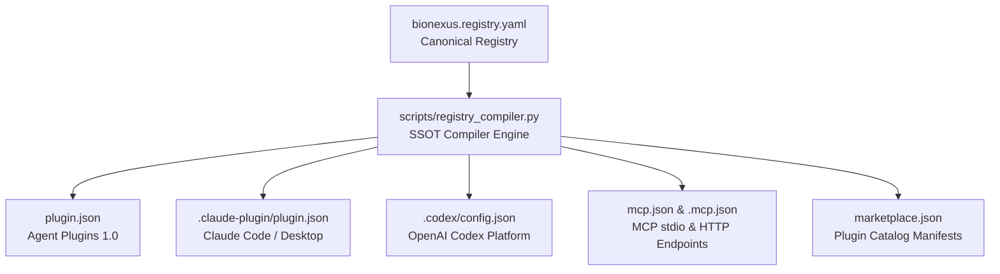

# BioNexus: The Scientific Reliability Layer for Agentic Biology

<div align="center">

[](https://agent-plugins.org/)
[](https://modelcontextprotocol.io/)
[](https://openai.com/)
[](https://claude.ai/)
[](https://cursor.com/)
[](https://www.python.org/)
[](tests/)
[](LICENSE)
[](#-regulatory-notice--compliance)

<p align="center">
  <b>BioNexus</b> transforms AI coding agents (<b>OpenAI Codex</b>, <b>Anthropic Claude Code</b>, <b>Cursor</b>) into rigorous, peer-reviewed computational biology assistants.<br/>
  It enforces gold-standard bioinformatics pipelines, deterministic 7-dimensional evidence grading, multi-database MCP connectivity, and non-negotiable scientific abstention when experimental conditions fail.
</p>

```text
✓ Single-Cell RNA-seq QC & Clustering (scanpy)    ✓ Spatial Transcriptomics & SVG Analysis (squidpy)
✓ Deep Generative VAE Modeling (scvi-tools)       ✓ nf-core Pipeline Automation (RNA-seq / Sarek)
✓ 16+ Local MCP Biological Database Tools         ✓ 9 Cloud-Hosted Biological MCP Endpoints
✓ 7-Dimensional EvidenceCard Grading              ✓ W3C PROV-O Provenance Tracking
✓ Zero-Key Out-of-the-Box Core Databases          ✓ Deterministic Scientific Refusal Protocols
```

</div>

---

## ⚡ 30-Second Quick Start: Choose Your AI Environment

Install BioNexus into your preferred environment in seconds:

```
┌─────────────────────────────────────────────────────────────────────────────────────────────┐
│                                CHOOSE YOUR INSTALLATION PATH                                │
├───────────────────────────────┬───────────────────────────────┬─────────────────────────────┤
│ 🤖 PATH A: AI Coding Agents   │ 🚀 PATH B: One-Click Local    │ 🐍 PATH C: Python pip / uv  │
│    (Codex, Claude, Cursor)    │    (Windows, macOS, Linux)    │    (Developers, HPC, CLI)   │
└───────────────────────────────┴───────────────────────────────┴─────────────────────────────┘
```

### 🤖 Path A: AI Coding Agents (No Python Setup Required)

#### 1. OpenAI Codex / ChatGPT (Recommended)
* **Option 1 (GUI — 3 clicks)**:
  1. In the Codex / ChatGPT interface, open **Settings → Plugins → Add Plugin Marketplace**.
  2. Enter the repository details:
     - **Source**: `HERRY423/BioNexus` *(or `https://github.com/HERRY423/BioNexus.git`)*
     - **Git Reference**: `main`
     - **Sparse Path**: *(Leave EMPTY — do NOT enter `.`)*
  3. Search for **`BioNexus`** and click **Install**.
* **Option 2 (CLI)**:
  ```bash
  codex plugin marketplace add HERRY423/BioNexus --ref main
  codex plugin add bionexus@bionexus-marketplace
  ```

#### 2. Anthropic Claude Code & Claude Desktop
* **Claude Code (CLI)**:
  ```bash
  claude plugin add HERRY423/BioNexus
  ```
* **Claude Desktop (`claude_desktop_config.json`)**:
  ```json
  {
    "mcpServers": {
      "bionexus": {
        "command": "python",
        "args": ["<absolute-path-to-BioNexus>/scripts/local_mcp_server.py"]
      }
    }
  }
  ```

#### 3. Cursor / Windsurf / VS Code (Model Context Protocol)
In Cursor **Settings → Features → MCP Servers → Add New MCP Server**:
- **Name**: `bionexus`
- **Type**: `command` (stdio)
- **Command**: `python scripts/local_mcp_server.py`

*Or add directly to project `.cursor/mcp.json`:*
```json
{
  "mcpServers": {
    "bionexus": {
      "command": "python",
      "args": ["${workspaceFolder}/scripts/local_mcp_server.py"]
    }
  }
}
```

---

### 🚀 Path B: One-Click Local Setup (Auto Hardware Detection & venv)

BioNexus includes zero-configuration automated initializers that detect your OS, CPU, and GPU (NVIDIA CUDA / Apple Silicon MPS / CPU) and build an optimized environment:

* **🪟 Windows (Double-Click or PowerShell)**:
  Double-click `setup.bat` or run in PowerShell:
  ```powershell
  .\setup.ps1
  ```
* **🍏 macOS / 🐧 Linux (Bash)**:
  ```bash
  chmod +x setup.sh && ./setup.sh
  ```

---

### 🐍 Path C: Python pip / uv (For Developers & HPC Clusters)

For existing Conda or Python 3.10+ environments:

```bash
# Clone the repository
git clone https://github.com/HERRY423/BioNexus.git
cd BioNexus

# 1. Base install
pip install -e .

# 2. Standard Single-Cell & Spatial Toolchain (Recommended)
pip install -e ".[goldchain,spatial,allotrope,mcp]"

# 3. High-Speed Full Installation with uv
uv pip install -e ".[all]"
```

#### Optional Dependency Extras Matrix
| Extra Tag | Key Included Packages | Analytical Capabilities |
| :--- | :--- | :--- |
| `[goldchain]` | `scanpy`, `anndata`, `pydeseq2`, `harmonypy`, `leidenalg` | scRNA-seq QC, batch correction, marker scoring, DESeq2 |
| `[scverse]` | `scvi-tools`, `torch`, `optuna` + `goldchain` | Deep generative modeling (scVI/scANVI), VAE latent space |
| `[spatial]` | `squidpy`, `anndata` | Spatial transcriptomics, Moran's I SVGs, spatial graph stats |
| `[survival]` | `lifelines` | Clinical survival analysis (Kaplan-Meier, log-rank, Cox PH) |
| `[plm]` | `transformers`, `torch` | Protein language models (ESM-2 zero-shot variant scoring) |
| `[structure]` | `abnumber`, `biotite` | IMGT antibody numbering, CDR parsing, Kabsch structural alignment |
| `[biologics]` | `ViennaRNA` | RNA secondary structure MFE & therapeutic mRNA design |
| `[allotrope]` | `allotropy`, `polars`, `openpyxl`, `pypdf` | Analytical instrument raw file conversion to Allotrope ASM JSON |
| `[mcp]` | `mcp>=1.0.0` | Official Model Context Protocol Python SDK integration |
| `[all]` | *All optional stacks + dev tools* | Complete biomedical bioinformatics & AI capability suite |

---

## 🩺 Environment Preflight & Diagnostic Doctor

Verify your installation and inspect active backend tiers at any time:

```bash
python scripts/doctor.py
```

### Diagnostic Output Example
```text
==============================================================================
                          BioNexus Environment Doctor
==============================================================================
Plugin Version:  0.8.0
Tier:            FULL (scverse ready, spatial ready)
Python Runtime:  3.11.x (CPython)

Active Analytical Capabilities:
  [PASS] core_ready      : numpy, pandas, scipy, scikit-learn
  [PASS] scverse_ready   : scanpy (1.10.x), anndata (0.10.x)
  [PASS] spatial_ready   : squidpy (1.3.x)
  [PASS] scvi_ready      : scvi-tools (1.1.x), PyTorch CUDA acceleration
  [PASS] survival_ready  : lifelines (0.28.x)
  [PASS] allotrope_ready : allotropy (0.1.x)
  [PASS] mcp_server      : FastMCP (1.0.x), 16 local tools + 9 hosted endpoints

Multi-Platform Manifest Synchronization:
  [PASS] Canonical SSOT: bionexus.registry.yaml
  [PASS] Manifest Drift: ZERO DRIFT across 12 platform targets (Codex, Claude, Cursor)
==============================================================================
```

---

## 🚀 Test Prompts (Copy & Paste to Verify)

Test BioNexus immediately in your AI coding environment:

### Prompt 1: Environmental Audit & Capability Survey
> *"Use BioNexus to inspect this workspace environment and report which biological workflows and database tools are currently available. Adhere strictly to the non-negotiable honesty policy."*

### Prompt 2: Zero-Key Biological Database Query (MCP)
> *"Using the BioNexus MCP database tools, fetch the protein details for human TP53 (UniProt 'P04637'). Retrieve its known domains, AlphaFold 3D structure pLDDT confidence, and associated Reactome pathways."*

### Prompt 3: Single-Cell RNA-seq Quality Control & Evidence Card
> *"Inspect my single-cell dataset 'sample.h5ad'. Execute MAD-based outlier detection, run Leiden clustering with numeric labels only (do not guess cell types), identify marker genes, and generate a 7-dimensional EvidenceCard."*

---

## 🧬 Scientific Evidence Operating Architecture

BioNexus enforces a strict distinction between **Execution Fidelity** (whether official algorithms executed) and **Scientific Evidence Quality** (statistical power, input integrity, parameter sensitivity, and external validation).

Every biological output is packaged with a deterministic **`EvidenceCard`** and a synthesized **`ConclusionStatus`**:

```text
┌─────────────────────────────────────────────────────────────────────────────────────────────┐
│                                   BioNexus Evidence Card                                    │
├──────────────────────────┬────────┬─────────────────────────────────────────────────────────┤
│ Dimension                │ Grade  │ Evaluation Criteria & Audited Ground Truth              │
├──────────────────────────┼────────┼─────────────────────────────────────────────────────────┤
│ 1. Execution Fidelity    │ A      │ Official peer-reviewed package executed (scanpy/squidpy)│
│ 2. Input Integrity       │ A      │ Raw count matrix verified non-negative integer values   │
│ 3. Assumption Validity   │ A      │ Coordinates & library scales verified against metadata  │
│ 4. Statistical Support   │ A      │ Multiple testing correction applied (Benjamini-Hochberg)│
│ 5. Parameter Robustness  │ B      │ Results tested across parameter bounds (e.g. k=6, 8, 10) │
│ 6. Cross-Method Agreement│ UNTEST │ Independent orthogonal method evaluation                │
│ 7. External Validation   │ UNTEST │ Concordance against orthogonal ground truth benchmarks │
├──────────────────────────┴────────┴─────────────────────────────────────────────────────────┤
│ Synthesized Conclusion Status:                                                              │
│ [ SUPPORTED | TENTATIVE | FRAGILE | CONFLICTED | ABSTAIN ]                                  │
└─────────────────────────────────────────────────────────────────────────────────────────────┘
```

---

## 🛠️ Core Scientific Skills & Non-Negotiable Honesty Rules

| Skill Directory | Primary Backend | Evidence Grade | Non-Negotiable Scientific Honesty Rule |
| :--- | :--- | :---: | :--- |
| [`single-cell-rna-qc`](file:///skills/single-cell-rna-qc) | `scanpy` | **Grade A** | Clusters remain **numeric only**. Never invent cell-type annotations without trained reference models. |
| [`spatial-transcriptomics`](file:///skills/spatial-transcriptomics) | `squidpy` | **Grade A** | Requires physical spatial coordinates. **Refuses** analysis if coordinates are missing. |
| [`scvi-tools`](file:///skills/scvi-tools) | `scvi-tools`, `torch` | **Grade A** | Deep generative modeling on raw counts. Refuses if GPU/torch dependencies are missing. |
| [`clinical-cohort-analysis`](file:///skills/clinical-cohort-analysis) | `lifelines` | **Grade A / C** | Uses Cox PH when `lifelines` is present; explicitly labels event-rate ratios as Grade C fallback. |
| [`variant-interpretation`](file:///skills/variant-interpretation) | `ACMG/AMP 2015`, Bayes LR | **Grade B** | Strictly labels outputs as Research-Use-Only (RUO). Explicitly disclaims CLIA/CAP certification. |
| [`protein-structure-analysis`](file:///skills/protein-structure-analysis) | `biotite`, PDB API | **Grade A** | Uses exact Kabsch RMSD / TM-score; reports AlphaFold pLDDT confidence intervals. |
| [`protein-language-models`](file:///skills/protein-language-models) | `transformers`, ESM-2 | **Grade A / C** | Requires explicit user opt-in (`BIONEXUS_ALLOW_ESM=1`); never masquerades BLOSUM as ESM. |
| [`biologics-design`](file:///skills/biologics-design) | `abnumber`, `ViennaRNA` | **Grade A / C** | Requires `abnumber` for IMGT numbering; uses real thermodynamic MFE for RNA secondary structures. |
| [`nextflow-development`](file:///skills/nextflow-development) | `nextflow`, `nf-core` | **Grade A** | Validates FASTQ/BAM schema and profile configurations before generating launch scripts. |
| [`instrument-data-to-allotrope`](file:///skills/instrument-data-to-allotrope) | `allotropy` | **Grade A** | Converts raw analytical instrument outputs (27+ vendors) into standardized Allotrope ASM JSON. |
| [`provenance-and-audit`](file:///skills/provenance-and-audit) | `bionexus.provenance` | **Grade A** | SHA-256 dataset hashing and W3C PROV-O JSON-LD tracking without claiming 21 CFR Part 11. |

---

## 🌐 Model Context Protocol (MCP) Biological Layer

BioNexus provides direct access to **16 biological tools** and **9 cloud-hosted servers** via the official Model Context Protocol (FastMCP):

### 1. Local Stdio MCP Server (`bionexus-local-mcp`)
*Zero API keys required for all core endpoints:*
* **Proteins & Structures**: `search_uniprot`, `search_alphafold`, `search_pdb`
* **Genomics & Regulation**: `search_ensembl`, `search_gnomad`, `search_gtex`, `search_geo`
* **Pathways & Networks**: `search_reactome`, `search_string`
* **Literature & Preprints**: `search_pubmed`, `search_pmc`, `search_biorxiv`
* **Molecules & Targets**: `search_chembl`, `search_opentargets`, `search_clinical_trials`
* **Cancer Genetics**: `search_cosmic` *(Local Census reference, RUO)*

### 2. Cloud-Hosted Streamable-HTTP Endpoints
* **NCBI PubMed**: `https://pubmed.mcp.claude.com/mcp`
* **bioRxiv / medRxiv**: `https://hcls.mcp.claude.com/biorxiv/mcp`
* **ChEMBL**: `https://hcls.mcp.claude.com/chembl/mcp`
* **Open Targets**: `https://mcp.platform.opentargets.org/mcp`
* **ClinicalTrials.gov**: `https://hcls.mcp.claude.com/clinical_trials/mcp`
* **BioRender**: `https://mcp.services.biorender.com/mcp`
* **Consensus AI**: `https://mcp.consensus.app/mcp`
* **Wiley Online Library**: `https://connector.scholargateway.ai/mcp`
* **Owkin Precision Medicine**: `https://mcp.k.owkin.com/mcp`

### 3. Optional Elevated Rate-Limit Credentials
To raise rate limits or connect enterprise lab platforms, copy `.env.example` to `.env` and run:
```bash
python scripts/auth_helper.py --status
```

---

## 🏛️ Architecture: Single Source of Truth (SSOT)

All client configurations across Codex, Claude, Cursor, and Python packages are deterministically compiled from [`bionexus.registry.yaml`](file:///bionexus.registry.yaml):



### Verification & Drift Prevention
```bash
# Generate all platform manifests
python scripts/registry_compiler.py --generate

# Verify zero drift in CI/CD (fails if files were manually edited out of sync)
python scripts/registry_compiler.py --check

# Validate URL syntax and connectivity
python scripts/registry_compiler.py --validate-endpoints
```

---

## 🧪 Testing & Quality Assurance

BioNexus is continuously tested on **Linux, Windows, and macOS** with **Python 3.10, 3.11, 3.12, and 3.13**:

```bash
# Run full unit test suite (190+ tests)
pytest

# Run backend lifecycle matrix tests (installed, missing, partial, incompatible, missing weights/binaries)
pytest tests/unit/test_backend_matrix.py -v

# Run code style & linting checks
ruff check .
```

---

## ⚖️ Regulatory Notice & Compliance

> **RESEARCH USE ONLY (RUO)**:
> BioNexus is intended solely for scientific research and educational purposes.
> - **Not for Clinical Diagnosis**: BioNexus is not certified under CLIA, CAP, or IVDR, and its outputs must never be used as the sole basis for clinical diagnostic or treatment decisions.
> - **Not 21 CFR Part 11 Certified**: Provenance tracking features generate standard cryptographic hashes and W3C PROV-O records, but do not constitute an FDA 21 CFR Part 11 compliant electronic signature system.
> - **AI Output Verification**: All computational outputs, evidence grades, and code generated by AI models should be reviewed and validated by qualified scientific personnel.

---

## 📄 License

BioNexus is open-source software licensed under the [Apache License, Version 2.0](LICENSE).
Copyright (c) 2026 BioNexus Team.
