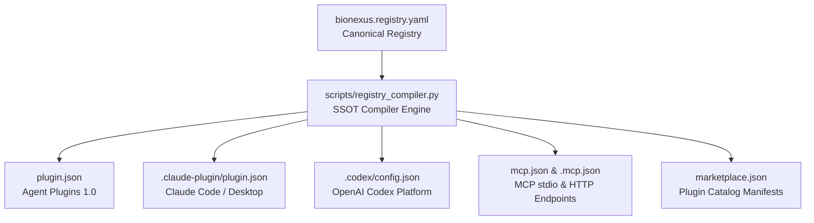

# BioNexus: The Scientific Reliability Layer for Agentic Biology

<div align="center">

[](https://agent-plugins.org/)
[](https://modelcontextprotocol.io/)
[](https://openai.com/)
[](https://claude.ai/)
[](https://cursor.com/)
[](https://www.python.org/)
[](tests/)
[](evals/)
[](LICENSE)
[](#-regulatory-notice--compliance)

<p align="center">
  <b>BioNexus catches biological analyses that should not have been run.</b><br/>
  It is the <b>Scientific Assertion Firewall</b> and reliability layer for agentic biology: deterministic preflight before compute,
  static audits of the analyses your tools (Scanpy, Seurat, Bioconductor, Claude, Codex, Cursor) already produce,
  and fail-closed verification of final claims against their evidence — backed by machine-readable Capability Contracts,
  the BN-Fxxx failure taxonomy, and the BioFailureBench trap corpus with ground truth.
</p>

```text
✓ Single-Cell RNA-seq QC & Clustering (scanpy)    ✓ Spatial Transcriptomics & SVG Analysis (squidpy)
✓ Deep Generative VAE Modeling (scvi-tools)       ✓ nf-core Pipeline Automation (RNA-seq / Sarek)
✓ 16+ Local MCP Biological Database Tools         ✓ 9 Cloud-Hosted Biological MCP Endpoints
✓ EvidenceCard 2.0 Epistemic Evaluation           ✓ Machine-Readable Capability Contracts
✓ 6-Stage Scientific Intent & Invariant Router    ✓ BioNexus Eval 3-Tier Benchmark (L1/L2/L3, fail-closed)
✓ Zero-Key Out-of-the-Box Core Databases          ✓ Deterministic Scientific Refusal Protocols
```

</div>

---

## 🔬 Why scientists install it: one case

Not "the Biological Capability ABI is advanced." This:

**Before BioNexus** — the agent just runs it:

```text
Request: "Run DE between these two clusters and identify condition-specific genes."

Agent:   Done. 2,341 cells vs 3,107 cells. 153 significant genes.
```

**With BioNexus** — the firewall blocks it and says why:

```text
BLOCKED: BN-F002 Pseudoreplication

Cells belong to only 3 donors per condition.
Cell-level hypothesis testing would inflate
the effective biological sample size.

Recommended:
aggregate counts by donor × condition
and perform pseudobulk DE.
```

This is the product: catching biological analyses that should not have been run — before, during, and after they happen (`bionexus preflight` / `audit` / `verify`).

---

## 🧭 Product Matrix & Scope Boundary

BioNexus is four layers with hard boundaries — not an ever-growing monolith ([full matrix](docs/product-matrix.md)):

| Layer | Contains |
|---|---|
| **bionexus-core** | BNS spec series · Biological Capability ABI · Failure Taxonomy (BN-Fxxx) · Fail-Closed Engine · Evidence Model |
| **bionexus-audit** | `preflight` · `audit` · `verify` |
| **bionexus-conformance** | capability certification (flagship track) · host conformance · BioFailureBench |
| **reference capability packs** | single-cell · spatial · reproducibility |

Explicitly **not** in scope, ever: planner, memory, multi-agent, chat UI, cloud workspace, notebook replacement, compute service, agent marketplace.

---

## 🌐 Standards & Interoperability (BNS-016)

BioNexus does **not** invent a proprietary research-data standard. Run capsules and Claim–Evidence Ledgers export through published community standards (`bionexus interop ro-crate|bco|check`):

```text
Claim–Evidence Ledger ──> W3C PROV-O ──┬── RO-Crate 1.1 (+ Workflow Run Crate profiles)
Run Capsule           ─────────────────┴── BioCompute Object (IEEE 2791-2020)
```

Institutional pipelines (Galaxy, DNAnexus, Seven Bridges, WorkflowHub) can ingest BioNexus outputs today without adopting anything else from BioNexus. Exports are deterministic, offline, and validated before they are written.

**Honest positioning** (`bionexus standards`): BioNexus is *not* an industry standard and does not claim to be one. The BNS series is an implementation proposal — discussable, criticizable, contributable — with the GA4GH AI Work Stream as the primary engagement window ([standards engagement](docs/standards-engagement.md)). Alignment statuses are machine-readable and honest: `implemented` (RO-Crate, Workflow Run Crate, BCO, PROV-O) · `aligned` (Bioschemas, nf-core) · `proposal` (GA4GH AI Work Stream) · `tracked` (ELIXIR, scverse, Bioconductor, WorkflowHub).

---

## ⚡ 30-Second Quick Start: Choose Your AI Environment

Install BioNexus into your preferred environment in seconds:

```
┌─────────────────────────────────────────────────────────────────────────────────────────────┐
│                                CHOOSE YOUR INSTALLATION PATH                                │
├───────────────────────────────┬───────────────────────────────┬─────────────────────────────┤
│ 🤖 PATH A: AI Coding Agents   │ 🚀 PATH B: One-Click Local    │ 🐍 PATH C: Python pip / uv  │
│    (Codex, Claude, Cursor)    │    (Windows, macOS, Linux)    │    (Developers, HPC, CLI)   │
└───────────────────────────────┴───────────────────────────────┴─────────────────────────────┘
```

### 🤖 Path A: AI Coding Agents (No Python Setup Required)

#### 1. OpenAI Codex / ChatGPT (Recommended)
* **Option 1 (GUI — 3 clicks)**:
  1. In the Codex / ChatGPT interface, open **Settings → Plugins → Add Plugin Marketplace**.
  2. Enter the repository details:
     - **Source**: `HERRY423/BioNexus` *(or `https://github.com/HERRY423/BioNexus.git`)*
     - **Git Reference**: `main`
     - **Sparse Path**: *(Leave EMPTY — do NOT enter `.`)*
  3. Search for **`BioNexus`** and click **Install**.
* **Option 2 (CLI)**:
  ```bash
  codex plugin marketplace add HERRY423/BioNexus --ref main
  codex plugin add bionexus@bionexus-marketplace
  ```

#### 2. Anthropic Claude Code & Claude Desktop
* **Claude Code (CLI)**:
  ```bash
  claude plugin add HERRY423/BioNexus
  ```
* **Claude Desktop (`claude_desktop_config.json`)**:
  ```json
  {
    "mcpServers": {
      "bionexus": {
        "command": "python",
        "args": ["<absolute-path-to-BioNexus>/scripts/local_mcp_server.py"]
      }
    }
  }
  ```

#### 3. Cursor / Windsurf / VS Code (Model Context Protocol)
In Cursor **Settings → Features → MCP Servers → Add New MCP Server**:
- **Name**: `bionexus`
- **Type**: `command` (stdio)
- **Command**: `python scripts/local_mcp_server.py`

*Or add directly to project `.cursor/mcp.json`:*
```json
{
  "mcpServers": {
    "bionexus": {
      "command": "python",
      "args": ["${workspaceFolder}/scripts/local_mcp_server.py"]
    }
  }
}
```

---

### 🚀 Path B: One-Click Local Setup (Auto Hardware Detection & venv)

BioNexus includes zero-configuration automated initializers that detect your OS, CPU, and GPU (NVIDIA CUDA / Apple Silicon MPS / CPU) and build an optimized environment:

* **🪟 Windows (Double-Click or PowerShell)**:
  Double-click `setup.bat` or run in PowerShell:
  ```powershell
  .\setup.ps1
  ```
* **🍏 macOS / 🐧 Linux (Bash)**:
  ```bash
  chmod +x setup.sh && ./setup.sh
  ```

---

### 🐍 Path C: Python pip / uv (For Developers & HPC Clusters)

For existing Conda or Python 3.10+ environments:

```bash
# Clone the repository
git clone https://github.com/HERRY423/BioNexus.git
cd BioNexus

# 1. Base install
pip install -e .

# 2. Standard Single-Cell & Spatial Toolchain (Recommended)
pip install -e ".[goldchain,spatial,allotrope,mcp]"

# 3. High-Speed Full Installation with uv
uv pip install -e ".[all]"
```

#### Optional Dependency Extras Matrix
| Extra Tag | Key Included Packages | Analytical Capabilities |
| :--- | :--- | :--- |
| `[goldchain]` | `scanpy`, `anndata`, `pydeseq2`, `harmonypy`, `leidenalg` | scRNA-seq QC, batch correction, marker scoring, DESeq2 |
| `[scverse]` | `scvi-tools`, `torch`, `optuna` + `goldchain` | Deep generative modeling (scVI/scANVI), VAE latent space |
| `[spatial]` | `squidpy`, `anndata` | Spatial transcriptomics, Moran's I SVGs, spatial graph stats |
| `[survival]` | `lifelines` | Clinical survival analysis (Kaplan-Meier, log-rank, Cox PH) |
| `[plm]` | `transformers`, `torch` | Protein language models (ESM-2 zero-shot variant scoring) |
| `[structure]` | `abnumber`, `biotite` | IMGT antibody numbering, CDR parsing, Kabsch structural alignment |
| `[biologics]` | `ViennaRNA` | RNA secondary structure MFE & therapeutic mRNA design |
| `[allotrope]` | `allotropy`, `polars`, `openpyxl`, `pypdf` | Analytical instrument raw file conversion to Allotrope ASM JSON |
| `[mcp]` | `mcp>=1.0.0` | Official Model Context Protocol Python SDK integration |
| `[all]` | *All optional stacks + dev tools* | Complete biomedical bioinformatics & AI capability suite |

---

## 🧱 The Scientific Assertion Firewall (BNS-013)

You keep using Scanpy, Seurat, Bioconductor, Claude, Codex, and Cursor. BioNexus does not replace any of them — it checks whether the scientific analyses they produce stand up. Three high-frequency entry points:

### 1. `bionexus preflight` — before the analysis

```bash
bionexus preflight sample.h5ad --intent differential-expression
```

```text
=== BioNexus Preflight ===

INTENT
Single-Cell Pseudobulk Differential Expression  (scrna.pseudobulk_de)

DATA STATE
[OK] matrix state: raw integer-like counts present
[!!] biological samples: 8 donors across 2 conditions; minimum 2 donors in a group

RISKS
[!!] BN-F006: condition strongly confounded with 'donor' (1:1 design)

DECISION
ABSTAIN -> REFUSE

ALLOWED
- at most: Exploratory within-sample marker ranking, explicitly not condition DE

FORBIDDEN CLAIM
- causal_interaction: Claiming causal molecular interaction or regulation from correlational evidence
- maturity above 'SUPPORTED' without external validation

REMEDY
- Add biological replicates that decouple condition from 'donor' or perform an explicit sensitivity analysis
```

Exit codes encode the verdict: `0` proceed (incl. capped/degraded), `1` refused or claim-blocked, `2` missing evidence.

### 2. `bionexus audit` — on the notebook or script

```bash
bionexus audit analysis.ipynb
```

Deterministic static rules screen the canonical trap classes — pseudoreplication, raw/log confusion, missing FDR, batch/condition confounding, wrong statistical unit, annotation without evidence, circular marker validation, missing negative controls, spatial coordinate substitution, parameter instability, overclaimed causality, backend substitution, and unexecuted code claims. Every finding cites its rule id, taxonomy failure id (BN-Fxxx), evidence line, and remedy. Honest scope: static rules have false negatives — absence of findings is **not** proof of validity.

### 3. `bionexus verify` — on the final results

```bash
bionexus verify results/          # reads the Claim–Evidence Ledger (BNS-012)
```

Each claim is re-resolved fail-closed against its evidence graph and the capability's ceiling; causal language beyond the evidence class is flagged as *not warranted*:

```text
CLAIM [CLAIM-DEMO-017]
  CXCL13+ T cells are enriched in tumor

  Evidence:
  [OK] EVID-DA: differential abundance test on independent donors (method_run, SUPPORTED)
  [~] EVID-SENS: context: parameter sensitivity: borderline at k=30 (statistical_result, FRAGILE)

  Warrant: SUPPORTED
  Not warranted:
  - "causal_interaction: ..." (forbidden)
```

---

## 🩺 Environment Preflight & Diagnostic Doctor

Verify your installation and inspect active backend tiers at any time:

```bash
python scripts/doctor.py
```

### Diagnostic Output Example
*Example output from a fully provisioned environment (see `bionexus doctor` in `src/bionexus/cli.py` for the exact format):*
```text
==============================================================================
                          BioNexus Environment Doctor
==============================================================================
Plugin Version:  0.9.0
Tier:            full

Active Analytical Capabilities:
  [PASS]    core_ready         : ready
  [PASS]    scverse_ready      : ready
  [PASS]    scvi_ready         : ready
  [PASS]    spatial_ready      : ready
  [PASS]    survival_ready     : ready
  [PASS]    nextflow_ready     : ready
==============================================================================
```
*Missing backends are reported as `[MISSING] ... : not installed` and lower the tier to `degraded` (or `refuse` when the core stack is absent). Manifest drift checking is a separate command: `bionexus registry --check`.*

---

## 🚀 Test Prompts (Copy & Paste to Verify)

Test BioNexus immediately in your AI coding environment:

### Prompt 1: Environmental Audit & Capability Survey
> *"Use BioNexus to inspect this workspace environment and report which biological workflows and database tools are currently available. Adhere strictly to the non-negotiable honesty policy."*

### Prompt 2: Zero-Key Biological Database Query (MCP)
> *"Using the BioNexus MCP database tools, fetch the protein details for human TP53 (UniProt 'P04637'). Retrieve its known domains, AlphaFold 3D structure pLDDT confidence, and associated Reactome pathways."*

### Prompt 3: Single-Cell RNA-seq Quality Control & Evidence Card
> *"Inspect my single-cell dataset 'sample.h5ad'. Execute MAD-based outlier detection, run Leiden clustering with numeric labels only (do not guess cell types), identify marker genes, and generate a 7-dimensional EvidenceCard."*

---

## 📜 BioNexus Scientific Contract Specification (BNS)

BioNexus is governed by a normative, machine-enforced scientific contract published in [`spec/`](spec/README.md) — nine RFC 2119-style documents with stable requirement IDs (`BNS-XX-nnn`) and live verification hooks:

| Spec | Governs |
|---|---|
| [BNS-001](spec/BNS-001-capability-contract.md) | Capability Contract & **Biological Capability ABI** |
| [BNS-002](spec/BNS-002-input-invariants.md) | Input semantic invariants (raw vs normalized, coordinates, cell types) |
| [BNS-003](spec/BNS-003-execution-fidelity.md) | Execution fidelity & gold backends |
| [BNS-004](spec/BNS-004-evidence-maturity.md) | EvidenceCard 2.0 maturity ladder & calibration |
| [BNS-005](spec/BNS-005-abstention-and-degradation.md) | Deterministic abstention & degraded advisories |
| [BNS-006](spec/BNS-006-provenance.md) | Provenance & reproducibility sidecars |
| [BNS-007](spec/BNS-007-cross-method-validation.md) | Parameter sensitivity & cross-method concordance |
| [BNS-008](spec/BNS-008-host-conformance.md) | Host agent conformance (Claude / Codex / any agent) |
| [BNS-009](spec/BNS-009-capability-lifecycle.md) | Capability lifecycle, frontier graduation, deprecation |
| [BNS-010](spec/BNS-010-capability-certification.md) | **Capability certification**: 14 evidence criteria, 4 tiers |
| [BNS-011](spec/BNS-011-failure-taxonomy.md) | **Scientific failure taxonomy** (BN-F001..F012) |
| [BNS-012](spec/BNS-012-claim-evidence-ledger.md) | **Claim–Evidence Ledger** (JSON / PROV-O JSON-LD) |
| [BNS-013](spec/BNS-013-scientific-assertion-firewall.md) | **Scientific Assertion Firewall**: preflight / audit / verify |
| [BNS-014](spec/BNS-014-biofailurebench.md) | **BioFailureBench**: the scientific trap corpus (BF-nnn) |
| [BNS-015](spec/BNS-015-flagship-certification.md) | **Flagship certification**: 3 externally-validated CERTIFIED capabilities |
| [BNS-016](spec/BNS-016-standards-interop.md) | **Standards interoperability**: RO-Crate / Workflow Run Crate / IEEE 2791 BCO; product scope boundary |

**The Biological Capability ABI** (`bionexus abi show <id>`): every capability projects to a stable Scientific ABI — input contracts (allowed matrix states, coordinate types), forbidden claims, execution references, validation policy, evidence ceilings, and provenance requirements. Any host agent connecting to BioNexus inherits this boundary and cannot bypass it.

**Fail-closed philosophy** (`bionexus prevent "<query>"`): *knowing when not to compute is a scientific capability.* The canonical gate `prevent_invalid_run()` maps missing evidence → ABSTAIN, invalid input → REFUSE, missing backend → DEGRADE WITH DISCLOSURE, violated assumption → BLOCK CLAIM, absent external validation → CAP EVIDENCE LEVEL. The most scarce BioNexus API is not `run()` — it is `prevent_invalid_run()`.

**Capability certification** (`bionexus certification`): skills deepen through evidence tiers — CERTIFIED (all 14 criteria: backend, input contract, invariants, failure modes, positive/negative/adversarial tests, public reference dataset, independent ground truth, parameter perturbation, degradation test, provenance test, cross-host test, external reviewer), VALIDATED, EXPERIMENTAL, CONNECTOR-ONLY. Tiers are **computed from recorded evidence, never asserted**; the blocking-criteria list per capability is the published roadmap to 10 CERTIFIED.

**Flagship certification track (BNS-015)**: *three CERTIFIED capabilities with independent external validation outweigh ten self-tested certifications.* The flagship set concentrates effort on the three highest-frequency failure surfaces — `scrna.pseudobulk_de` (cell ≠ biological replicate), `scrna.annotation_evidence` (how much evidence backs a cell-type label), and `spatial.inference_validity` (can a spatial conclusion survive its alternative explanations). The four external criteria (public dataset, independent ground truth, cross-host test, external reviewer) cannot be satisfied by the implementer alone — that is the point.

**Scientific failure taxonomy** (`bionexus failures list`): twelve failure modes (BN-F001 assay-state confusion … BN-F012 unexecuted maturity claim), each with definition, detection rule, required fail-closed behavior, acceptable degradation, and benchmark coverage. Since BioFailureBench, **all twelve modes carry wired detection and passing benchmark traps** — the three formerly-open gaps (BN-F004 identifier mismatch, BN-F005 missing FDR, BN-F008 cross-database contradiction) are closed. This ontology is BioNexus's durable asset.

**Claim–Evidence Ledger** (`bionexus ledger`): claims as auditable dependency graphs (`supported_by` / `contradicted_by` / `depends_on` → fail-closed status resolution), persisted as JSON and projectable to PROV-O JSON-LD. Deliberately a data structure, not a graph platform. `bionexus verify` is its productized form.

**BioFailureBench** (`bionexus bench validate` / `bionexus eval --suite biofailurebench`, [BNS-014](spec/BNS-014-biofailurebench.md)): a scientific trap corpus that does not test "can the AI answer biology questions" — it tests **whether the AI realizes an analysis should not have been run, or that a conclusion does not stand**. Every trap carries eight fields (data, intended analysis, hidden flaw, expected detection, allowed computation, forbidden claim, remediation, reference), links into the BN-Fxxx taxonomy, and runs identically on any host (Claude, Codex, Cursor, Biomni, future agents). Software, skills, and prompts are easy to copy; an expert-maintained trap corpus with ground truth is not. Current state: **26 traps (23 gating, all passing deterministically; 3 frontier known limitations), covering all 12 taxonomy modes** including a positive control so the bench cannot degrade into an all-refusal benchmark.

**Honest calibration (BNS-LC-004..006)**: the benchmark separates the *gating track* (guaranteed behavior, drives CRI) from the *frontier track* (`known_limitation` probes, reported with honest pass/fail). A gating-only 100% is explicitly not a calibration claim; calibration spans the union. Current honest state: **gating 61/61 attempted (65 total, 4 L3 skipped no-backend) · frontier 7/14 · union 90.7% · union macro-F1 90.1%** — see [`evals/reports/benchmark_report.md`](evals/reports/benchmark_report.md).

---

## 🧬 Scientific Evidence Operating Architecture

BioNexus enforces a strict distinction between **Execution Fidelity** (whether official algorithms executed) and **Scientific Evidence Quality** (statistical power, input integrity, parameter sensitivity, and external validation).

Every biological output is packaged with a deterministic **`EvidenceCard`** and a synthesized **`ConclusionStatus`**:

```text
┌─────────────────────────────────────────────────────────────────────────────────────────────┐
│                                   BioNexus Evidence Card                                    │
├──────────────────────────┬────────┬─────────────────────────────────────────────────────────┤
│ Dimension                │ Grade  │ Evaluation Criteria & Audited Ground Truth              │
├──────────────────────────┼────────┼─────────────────────────────────────────────────────────┤
│ 1. Execution Fidelity    │ A      │ Official peer-reviewed package executed (scanpy/squidpy)│
│ 2. Input Integrity       │ A      │ Raw count matrix verified non-negative integer values   │
│ 3. Assumption Validity   │ A      │ Coordinates & library scales verified against metadata  │
│ 4. Statistical Support   │ A      │ Multiple testing correction applied (Benjamini-Hochberg)│
│ 5. Parameter Robustness  │ B      │ Results tested across parameter bounds (e.g. k=6, 8, 10) │
│ 6. Cross-Method Agreement│ UNTEST │ Independent orthogonal method evaluation                │
│ 7. External Validation   │ UNTEST │ Concordance against orthogonal ground truth benchmarks │
├──────────────────────────┴────────┴─────────────────────────────────────────────────────────┤
│ Synthesized Conclusion Status:                                                              │
│ [ SUPPORTED | TENTATIVE | FRAGILE | CONFLICTED | ABSTAIN ]                                  │
└─────────────────────────────────────────────────────────────────────────────────────────────┘
```

---

## 🛠️ Core Scientific Skills & Non-Negotiable Honesty Rules

| Skill Directory | Primary Backend | Evidence Grade | Non-Negotiable Scientific Honesty Rule |
| :--- | :--- | :---: | :--- |
| [`single-cell-rna-qc`](file:///skills/single-cell-rna-qc) | `scanpy` + `pydeseq2` | **Grade A** | Clusters remain **numeric only**. Never invent cell-type annotations without trained reference models. |
| [`spatial-transcriptomics`](file:///skills/spatial-transcriptomics) | `squidpy` | **Grade A** | Requires physical spatial coordinates. **Refuses** analysis if coordinates are missing. |
| [`scvi-tools`](file:///skills/scvi-tools) | `scvi-tools`, `torch` | **Grade A** | Deep generative modeling on raw counts. Refuses if GPU/torch dependencies are missing. |
| [`nextflow-development`](file:///skills/nextflow-development) | `nextflow`, `nf-core` | **Grade A** | Validates FASTQ/BAM schema and profile configurations before generating launch scripts. |
| [`instrument-data-to-allotrope`](file:///skills/instrument-data-to-allotrope) | `allotropy` | **Grade A** | Converts raw analytical instrument outputs (27+ vendors) into standardized Allotrope ASM JSON. |
| [`provenance-and-audit`](file:///skills/provenance-and-audit) | `bionexus.provenance` | **Grade B** | SHA-256 dataset hashing and W3C PROV-O JSON-LD tracking without claiming 21 CFR Part 11. |
| [`clinical-cohort-analysis`](file:///skills/clinical-cohort-analysis) | `lifelines` (optional) + `scipy` | **Grade C** | Uses Cox PH when `lifelines` is present; explicitly labels event-rate ratios as Grade C fallback. |
| [`variant-interpretation`](file:///skills/variant-interpretation) | local ACMG combiner + PWM splice | **Grade C** | Deterministic ACMG combination heuristics, strictly Research-Use-Only (RUO). Explicitly disclaims CLIA/CAP certification. |
| [`protein-structure-analysis`](file:///skills/protein-structure-analysis) | RCSB/AlphaFold HTTP + Kabsch | **Grade C** | Uses exact Kabsch superposition on fetched coordinates; geometry heuristics are labeled Grade C, not gold-standard force fields. |
| [`protein-language-models`](file:///skills/protein-language-models) | ESM-2 (opt-in) / `BLOSUM62` | **Grade C** | Requires explicit user opt-in (`BIONEXUS_ALLOW_ESM=1`); never masquerades BLOSUM as ESM. |
| [`biologics-design`](file:///skills/biologics-design) | `abnumber` (optional) + sequence motifs | **Grade C** | Uses `abnumber` for IMGT numbering when installed; regex/motif fallbacks are explicitly labeled Grade C heuristics. |
| [`multiome-integration`](file:///skills/multiome-integration) | `sklearn` ExtraTrees | **Grade C** | Co-expression heuristics only — explicitly **not** SCENIC+/GRNBoost2; disabled by default (opt-in via `SKILL.legacy.md`). |

> **Grade provenance**: Evidence grades in this table mirror the canonical Single Source of Truth ([`bionexus.registry.yaml`](file:///bionexus.registry.yaml), `skills.canonical` + `skills.heuristics`). Overclaims are rejected in CI by `tests/unit/test_readme_consistency.py`. Grade A = community gold-standard backend executed; Grade C = labeled local heuristic; optional-backends skills degrade honestly to C when the backend is absent.

---

## 🌐 Model Context Protocol (MCP) Biological Layer

BioNexus provides direct access to biological tools, resources, and cloud-hosted servers via the official Model Context Protocol (FastMCP) with deterministic, non-overlapping routing:

### 1. Local Stdio MCP Server (`bionexus-local-mcp`)
*Zero API keys required for all core endpoints:*
* **Core Local Unique Tools (Default Active — 9 Tools)**:
  * **Proteins & Structures**: `search_uniprot`, `search_alphafold`, `search_pdb`
  * **Genomics & Regulation**: `search_ensembl`, `search_gnomad`, `get_gene_expression` (GTEx), `search_geo`
  * **Pathways & Networks**: `search_reactome`, `search_string`
* **Workflow Resources & Prompts (Always Active)**:
  * 6 production YAML workflows/configs (`bionexus://workflows/...`, `bionexus://configs/...`)
  * 6 structured bioinformatic prompts (`drug_target_analysis`, `variant_pathogenicity`, etc.)
* **Hosted Fallbacks (Opt-in Disaster Recovery via `BIONEXUS_LOCAL_HOSTED_FALLBACKS=1`)**:
  * `search_pubmed`, `get_pubmed_article`, `search_biorxiv`, `search_chembl`, `search_opentargets`, `search_clinical_trials`, `search_cosmic` *(hidden by default to avoid duplicate tool routing with cloud endpoints)*

### 2. Cloud-Hosted Streamable-HTTP Endpoints (10 Endpoints)
* **NCBI PubMed**: `https://pubmed.mcp.claude.com/mcp`
* **bioRxiv / medRxiv**: `https://hcls.mcp.claude.com/biorxiv/mcp`
* **ChEMBL**: `https://hcls.mcp.claude.com/chembl/mcp`
* **Open Targets**: `https://mcp.platform.opentargets.org/mcp`
* **ClinicalTrials.gov**: `https://hcls.mcp.claude.com/clinical_trials/mcp`
* **BioRender**: `https://mcp.services.biorender.com/mcp`
* **Consensus AI**: `https://mcp.consensus.app/mcp`
* **Wiley Online Library**: `https://connector.scholargateway.ai/mcp`
* **Owkin Precision Medicine**: `https://mcp.k.owkin.com/mcp`
* **Synapse**: `https://mcp.synapse.org/mcp`

### 3. Optional Elevated Rate-Limit Credentials
To raise rate limits or connect enterprise lab platforms, copy `.env.example` to `.env` and run:
```bash
python scripts/auth_helper.py --status
```

---

## 🏛️ Architecture: Single Source of Truth (SSOT)

All client configurations across Codex, Claude, Cursor, and Python packages are deterministically compiled from [`bionexus.registry.yaml`](file:///bionexus.registry.yaml):



### Verification & Drift Prevention
```bash
# Generate all platform manifests
python scripts/registry_compiler.py --generate

# Verify zero drift in CI/CD (fails if files were manually edited out of sync)
python scripts/registry_compiler.py --check

# Validate URL syntax and connectivity
python scripts/registry_compiler.py --validate-endpoints
```

---

## 🧪 Testing & Reliability Benchmark

BioNexus is continuously tested on **Linux, Windows, and macOS** with **Python 3.10, 3.11, and 3.12** (see `.github/workflows/ci.yml`; Python 3.13 is not yet covered by CI):

```bash
# Run the full unit test suite
pytest

# Run BioNexus Eval Benchmark across all 8 reliability pillars.
# Strict mode (--strict / BIONEXUS_EVAL_STRICT=1) fails on any L3 case that
# could not verify its planted-truth outcome because a backend was missing.
bionexus eval --strict

# Validate / run BioFailureBench, the scientific trap corpus (BNS-014)
bionexus bench validate
bionexus eval --suite biofailurebench

# Run backend lifecycle matrix tests
pytest tests/unit/test_backend_matrix.py -v

# Run code style & linting checks
ruff check .
```

---

## 📚 Governance, Documentation & Releases

- 📜 **[Changelog & Release Notes](CHANGELOG.md)**: Full record of changes and release highlights.
- 🏛️ **[Semantic Versioning Policy](docs/versioning-policy.md)**: Release lifecycle, support windows, and versioning rules.
- 🤖 **[Compatibility Matrix](docs/compatibility-matrix.md)**: AI agent hosts, Python runtimes, and bioinformatics backend versions.
- 🚀 **[Migration & Upgrade Guide](docs/migration-guide.md)**: How to migrate from EvidenceCard 1.0 to EvidenceCard 2.0.
- ⏳ **[Deprecation Policy & Sunset Schedule](docs/deprecation-policy.md)**: 3-phase deprecation policy and timeline.
- 🛠️ **[Developer & Skill Development Guide](docs/plugin-development.md)**: Anatomy of a Gold Reference skill and CLI scaffolding.
- 🤝 **[Contributing Guidelines](CONTRIBUTING.md)**: Scientific honesty contract and pull request acceptance criteria.

---

## ⚖️ Regulatory Notice & Compliance

> **RESEARCH USE ONLY (RUO)**:
> BioNexus is intended solely for scientific research and educational purposes.
> - **Not for Clinical Diagnosis**: BioNexus is not certified under CLIA, CAP, or IVDR, and its outputs must never be used as the sole basis for clinical diagnostic or treatment decisions.
> - **Not 21 CFR Part 11 Certified**: Provenance tracking features generate standard cryptographic hashes and W3C PROV-O records, but do not constitute an FDA 21 CFR Part 11 compliant electronic signature system.
> - **AI Output Verification**: All computational outputs, evidence grades, and code generated by AI models should be reviewed and validated by qualified scientific personnel.

---

## 📄 License

BioNexus is open-source software licensed under the [Apache License, Version 2.0](LICENSE).
Copyright (c) 2026 BioNexus Team.

