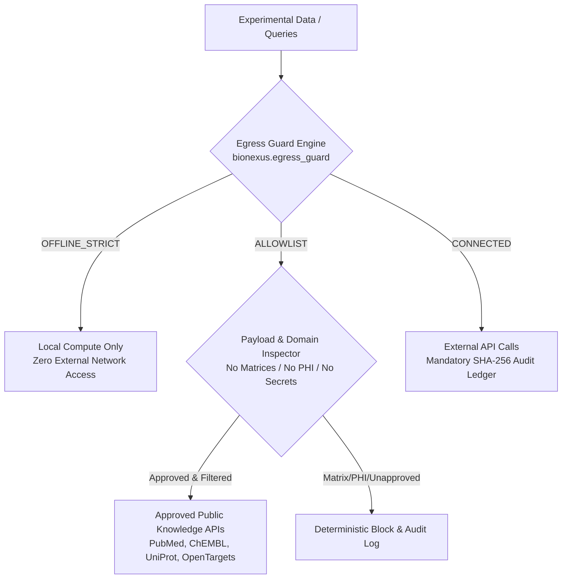

# BioNexus Security & Data Governance Policy

BioNexus is designed as a **Warrant-First Scientific Reliability & Data Governance Layer** for biological AI agents and computational laboratories. Because BioNexus operates in clinical, biomedical, and biopharma environments handling pre-publication discoveries, proprietary IP, and patient genomics, security and data confidentiality are foundational invariants.

---

## 1. Supported Versions

We provide security updates and patches for the following versions:

| Version | Supported | Notes |
| :--- | :--- | :--- |
| `0.10.x` | :white_check_mark: | Current stable release line |
| `< 0.10.0` | :x: | Legacy / unsupported |

---

## 2. Reporting a Vulnerability

If you discover a security vulnerability, data leakage vector, or prompt injection vulnerability in BioNexus:

1. **Do NOT file a public GitHub Issue or Discussion.**
2. Email the core security team at `security@bionexus.org` (or contact the maintainers via GitHub Private Vulnerability Reporting).
3. Include:
   - Description of the vulnerability and attack vector.
   - Proof-of-concept (PoC) script or minimal reproducible example.
   - Potential impact on data confidentiality, integrity, or computational safety.
4. We acknowledge reports within **48 hours** and provide a coordinated disclosure timeline (typically 30–90 days).

---

## 3. Data Governance & Egress Control Architecture

BioNexus enforces a formal **Data Egress Contract** (`bionexus.egress_guard`) with three runtime modes:

### Egress Modes

- **`OFFLINE_STRICT`**: Air-gapped mode. All outgoing network connections, cloud MCP tools, and external HTTP endpoints are deterministically blocked at runtime.
- **`ALLOWLIST`** (Default): Permitted outgoing calls are strictly restricted to approved public scientific knowledge repositories (e.g., NCBI PubMed, Ensembl, UniProt, ChEMBL, Open Targets). **Invariant:** Zero raw biological matrices, expression count tables, unindexed patient sequences, or clinical PHI may be transmitted.
- **`CONNECTED`**: External API calls allowed for integrated cloud services, with mandatory cryptographic audit logging of all requests and responses.

---

## 4. Cryptographic Audit Trail

Every external MCP and network invocation is logged into an immutable audit ledger (`logs/egress_audit.jsonl`) recording:
- `timestamp`: UTC ISO-8601 timestamp.
- `endpoint`: Destination URL / MCP service.
- `purpose`: Scientific rationale for the external query.
- `fields_transmitted`: Metadata keys transmitted (verifying absence of raw matrices or PHI).
- `payload_sha256`: SHA-256 hash of outgoing payload.
- `response_hash`: SHA-256 hash of returned data.
- `egress_mode`: Active policy mode (`OFFLINE_STRICT` / `ALLOWLIST` / `CONNECTED`).
- `outcome`: `PERMITTED` or `BLOCKED`.

---

## 5. Security & Governance Documentation Index

- [Threat Model](docs/security/THREAT_MODEL.md): Comprehensive assets, threat actors, and attack surface analysis.
- [Data Classification Guidance](docs/security/DATA_CLASSIFICATION.md): Handling guidelines for Public, Proprietary Unpublished, and Clinical PHI data.
- [Secret Handling Policy](docs/security/SECRET_HANDLING.md): Safe credential storage, zero-leakage invariants, and pre-commit detection.
- [Software Bill of Materials (SBOM)](docs/security/SBOM.md): Component inventory, vulnerability scanning, and license compliance.
- [Release Signing & Attestations](docs/security/RELEASE_SIGNING.md): Sigstore / Cosign cryptographic provenance verification.
