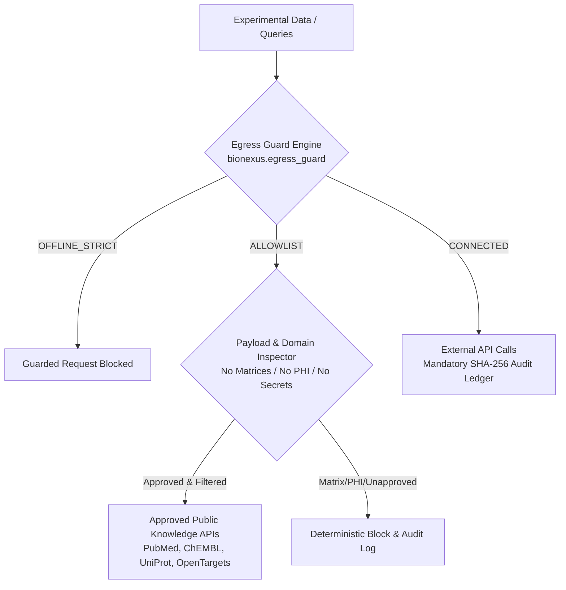

# BioNexus Security & Data Governance Policy

BioNexus is designed as a **Warrant-First Scientific Reliability & Data Governance Layer** for biological AI agents and computational laboratories. Because BioNexus is designed for research settings that may be deployed in biomedical and biopharma environments handling pre-publication discoveries, proprietary IP, and research genomics, security and data confidentiality are foundational invariants.

---

## 1. Supported Versions

The project is a release candidate. The authoritative package version is in
`src/bionexus/versions.py`; see [MAINTENANCE.md](MAINTENANCE.md).

| Version | Supported | Notes |
| :--- | :--- | :--- |
| Current `1.0.0` RC line | Best effort | No GA/LTS or guaranteed backport window |
| Older versions | No standing backport commitment | Retain pinned copies for historical reproduction |

The proposed Core 1.x GA policy in [MAINTENANCE.md](MAINTENANCE.md#core-1x-ga-support-policy)
defines a 12-month window, latest-minor fixes, 90-day critical-fix backports for
superseded minors (within that window), and EOL notices. It is **NOT ACTIVATED**:
the stable release must publish actual dates and named maintainer acceptance.
Until then, the RC support table above remains authoritative.

---

## 2. Reporting a Vulnerability

If you discover a security vulnerability, data leakage vector, or prompt injection vulnerability in BioNexus:

1. **Do NOT file a public GitHub Issue or Discussion.**
2. Use GitHub Private Vulnerability Reporting when enabled. If unavailable, request a private reporting channel from repository maintainers without posting vulnerability details. This document does not establish a monitored security mailbox.
3. Include:
   - Description of the vulnerability and attack vector.
   - Proof-of-concept (PoC) script or minimal reproducible example.
   - Potential impact on data confidentiality, integrity, or computational safety.
4. Handling is best effort. Agree disclosure timing with the responding maintainer; no fixed response-time SLA or staffed on-call rota is established.

---

## 3. Data Governance & Egress Control Architecture

`bionexus.egress_guard` applies three modes to calls routed through its guarded
interfaces. It is not a process sandbox or system firewall. Arbitrary host MCP
calls, third-party libraries and direct networking can bypass those interfaces.
Institutional isolation also requires host and operating-system controls.

### Egress Modes

- **`OFFLINE_STRICT`**: Blocks requests evaluated through the guard. This setting alone does not make an arbitrary Python process air-gapped.
- **`ALLOWLIST`** (Default): Guarded calls apply configured domain and payload checks; these are not complete detectors of sensitive biological or clinical information.
- **`CONNECTED`**: Guarded calls use the connected policy and its logging behavior; no blanket guarantee is made about all host or service operations.

---

## 4. Cryptographic Audit Trail

Guarded operations can record local audit entries (`logs/egress_audit.jsonl`, or
the configured path) with fields including:
- `timestamp`: UTC ISO-8601 timestamp.
- `endpoint`: Destination URL / MCP service.
- `purpose`: Scientific rationale for the external query.
- `fields_transmitted`: Metadata keys transmitted (verifying absence of raw matrices or PHI).
- `payload_sha256`: SHA-256 hash of outgoing payload.
- `response_hash`: SHA-256 hash of returned data.
- `egress_mode`: Active policy mode (`OFFLINE_STRICT` / `ALLOWLIST` / `CONNECTED`).
- `outcome`: `PERMITTED` or `BLOCKED`.

Local files are not inherently immutable, and hashes alone do not authenticate
their producer. Verify actual integration logging and apply filesystem controls
and external anchoring. DE bundle file verification likewise does not establish
scientific truth, statistical execution or producer identity.

---

## 5. Security & Governance Documentation Index

- [Threat Model](docs/security/THREAT_MODEL.md): Comprehensive assets, threat actors, and attack surface analysis.
- [Data Classification Guidance](docs/security/DATA_CLASSIFICATION.md): Handling guidelines for Public, Proprietary Unpublished, and Clinical PHI data.
- [Secret Handling Policy](docs/security/SECRET_HANDLING.md): Safe credential storage, zero-leakage invariants, and pre-commit detection.
- [Software Bill of Materials (SBOM)](docs/security/SBOM.md): Component inventory, vulnerability scanning, and license compliance.
- [Release Signing & Attestations](docs/security/RELEASE_SIGNING.md): Sigstore / Cosign cryptographic provenance verification.
