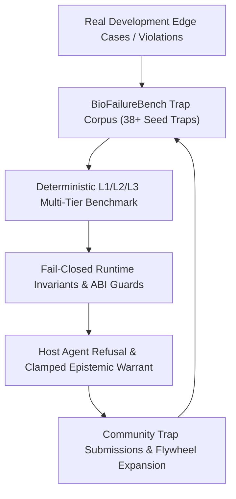

# BioFailureBench Data Flywheel & Scientific Failure Taxonomy v1 (BNS-014 / BNS-011)

> **"Code and prompt wrappers are easily replicated. A ground-truth corpus of deterministic biological scientific traps with fail-closed invariants is an insurmountable evaluation and data moat."**

---

## 1. Executive Summary & Epistemic Moat

In computational biology and agentic AI, functional capabilities (e.g. running a script or wrapping an API) are trivial to implement. However, **knowing when NOT to compute, when to refuse, and when a biological conclusion is invalid** represents the true bottleneck in autonomous scientific discovery.

**BioFailureBench** (`BNS-014`) combined with **Failure Taxonomy v1** (`BNS-011`, `bionexus.failure_taxonomy.v1`) forms a self-reinforcing scientific data flywheel:



---

## 2. Failure Taxonomy v1 (`bionexus.failure_taxonomy.v1`)

The Failure Taxonomy formalizes 12 core failure modes across 4 fundamental scientific categories:

| Failure ID | Name | Category | Severity | Primary Refusal Trigger / Detection Invariant | Default Action |
|---|---|---|---|---|---|
| `BN-F001` | **Assay-state confusion** | `DATA_INTEGRITY` | `CRITICAL` | Input matrix state != count-model likelihood (floats to NB GLM) | `REFUSE` |
| `BN-F002` | **Pseudoreplication** | `INFERENTIAL_DESIGN` | `CRITICAL` | Biological replicate count \(n < 2\) per condition | `REFUSE` |
| `BN-F003` | **Unsupported annotation** | `SEMANTIC_CLAIM` | `HIGH` | Cell type asserted from unsupervised clustering without reference | `BLOCK CLAIM` |
| `BN-F004` | **Identifier mismatch** | `DATA_INTEGRITY` | `CRITICAL` | Silent cross-namespace join (HGNC vs Ensembl, release version drift) | `REFUSE` |
| `BN-F005` | **Missing multiple-testing** | `INFERENTIAL_DESIGN` | `HIGH` | Uncorrected p-values reported across genome-scale scan | `CAP EVIDENCE LEVEL` |
| `BN-F006` | **Invalid model assumption** | `INFERENTIAL_DESIGN` | `CRITICAL` | Crossing survival curves, 100% censoring, unmodeled confounding | `BLOCK CLAIM / REFUSE` |
| `BN-F007` | **Parameter instability** | `INFERENTIAL_DESIGN` | `MEDIUM` | Cluster / finding unstable across resolution sweep (\(ARI < 0.5\)) | `CAP EVIDENCE LEVEL` |
| `BN-F008` | **Cross-database contradiction** | `DATA_INTEGRITY` | `HIGH` | Discordant classifications between reference knowledge bases | `CONFLICTED` |
| `BN-F009` | **Missing spatial provenance** | `DATA_INTEGRITY` | `CRITICAL` | UMAP/PCA coordinates passed off as physical tissue space; collinear spots | `REFUSE` |
| `BN-F010` | **Backend masquerading** | `SYSTEM_DEGRADATION` | `CRITICAL` | Heuristic fallback passed off as canonical gold backend | `DEGRADE WITH DISCLOSURE` |
| `BN-F011` | **Claim inflation** | `SEMANTIC_CLAIM` | `CRITICAL` | Correlation as causation, spatial proximity as cell communication | `BLOCK CLAIM` |
| `BN-F012` | **Unexecuted maturity claim** | `SEMANTIC_CLAIM` | `HIGH` | Inflated evidence maturity exceeding capability evidence ceiling | `CAP EVIDENCE LEVEL` |

---

## 3. The 8-Field Trap Contract (BNS-BF-001 / BNS-BF-002)

Every trap in the BioFailureBench corpus satisfies an explicit 8-field scientific contract:

1. **Intended Analysis (`prompt`)**: The analytical query posed to the agent.
2. **Input Context (`data_metadata`)**: Structured metadata describing the matrix, replicates, coordinates, or missing information.
3. **Hidden Flaw (`failure_mode` & `description`)**: The specific mathematical or biological invariant violated (prefixed `TRAP:`).
4. **Expected Detection (`expected_status` & `expected_violations`)**: Whether BioNexus must `ABSTAIN`, require `NEEDS_DATA`, or permit with `DEGRADED_ADVISORY`.
5. **Allowed Computation (`allowed_computation`)**: Explicitly describes what computation remains scientifically valid.
6. **Forbidden Claim (`forbidden_claim`)**: Explicitly bars unjustified conclusions.
7. **Actionable Remediation (`required_remedies`)**: Prescriptive guidance to correct the study design.
8. **Literature Reference (`reference`)**: Peer-reviewed justification for the invariant.

---

## 4. Community Submission & Validation Workflow

External researchers and developers can contribute new traps through standardized formats:

### 1. Generate Template
```bash
bionexus bench template -o my_trap.yaml
```

### 2. Validate Locally
```bash
bionexus bench validate-trap my_trap.yaml
```

### 3. Submit
- **GitHub Issue**: Use the [BioFailureBench Scientific Trap Submission](https://github.com/HERRY423/BioNexus/issues/new?template=2b_biofailure_trap_submission.yml) form.
- **Pull Request**: Add your trap to `evals/datasets/biofailurebench.yaml`.

---

## 5. CLI Commands

```bash
# Display corpus coverage and data flywheel metrics
bionexus bench stats

# Validate entire corpus integrity and taxonomy linkage
bionexus bench validate

# Run the 38-trap benchmark suite
bionexus bench run

# Show Capability x Failure Mode mapping matrix
bionexus failures matrix

# Dump Failure Taxonomy v1 specification
bionexus failures taxonomy --json
```
