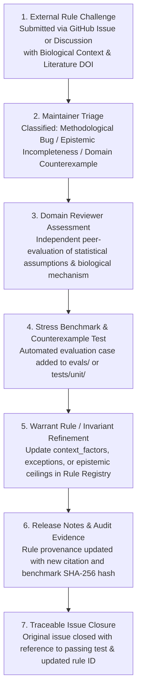

# Scientific Rule Challenge & Closed-Loop Governance Lifecycle

## 1. Principle & Motivation

In BioNexus, scientific rules are **falsifiable empirical models**, not immutable dogma. As new biological assays (e.g. single-cell combinatorial indexing, spatial sub-cellular barcoding) and statistical methods emerge, the community governance process must actively absorb domain feedback and evolve the rule registry.

A mature governance lifecycle is defined by its **end-to-end closed loop**:

---

## 2. The 7-Stage Closed-Loop Process

### Stage 1: External Challenge Intake
- **Channel**: GitHub Issue Form ([`.github/ISSUE_TEMPLATE/scientific_rule_challenge.yml`](../../.github/ISSUE_TEMPLATE/scientific_rule_challenge.yml)) or GitHub Discussions ([`Scientific Rule Challenge`](https://github.com/HERRY423/BioNexus/discussions/categories/scientific-rule-challenge)).
- **Mandatory Submission Requirements**:
  1. Target Rule ID (e.g., `INV-001`, `INV-004`, `BN-F002`, `RULE-018`).
  2. Biological Context (e.g., paired isogenic tumor vs normal, high-throughput combinatorial CRISPR screen, multi-modal CITE-seq).
  3. Literature Evidence (peer-reviewed papers with DOIs or official regulatory guidance).
  4. Proposed Alternative Formulation (context-conditioned factor, exception, or calibrated threshold adjustment).

### Stage 2: Maintainer Triage (within 72 hours)
Maintainers tag and triage the submission into one of three classes:
- `triage:counterexample`: Demonstrates a biological scenario where the existing rule produces a false refusal or improper claim ceiling.
- `triage:epistemic-incompleteness`: Identifies a missing context factor (e.g. within-donor dispersion, paired vs unpaired design).
- `triage:methodological-bug`: Discloses a mathematical or implementation error in rule evaluation.

### Stage 3: Domain Reviewer Independent Assessment
- Assigned to a designated computational biology / statistics domain reviewer.
- Reviewer assesses:
  - Is the counterexample biologically and statistically sound?
  - Does the proposed exception compromise fail-closed safety invariants?
  - Is the literature consensus established or debated?

### Stage 4: Stress Benchmark & Counterexample Test Case
- Before modifying any rule in code or registry, an automated reproduction test case MUST be added to `tests/unit/` or `evals/`.
- The test proves:
  1. Baseline behavior before rule modification.
  2. Desired behavior under the new context-conditioned rule.
  3. No regression on existing flagship benchmarks.

### Stage 5: Rule Registry & Invariant Refinement
- Update `src/bionexus/data/rule_registry.json` and `review/SCIENTIFIC_RULE_CATALOG.json`:
  - Append new `context_factors`.
  - Add explicit `biological_exceptions`.
  - Record new `literature_provenance` references with DOIs.
  - Recompile platform manifests via `python scripts/registry_compiler.py --generate`.

### Stage 6: Release Notes & Cryptographic Provenance
- Record the rule change in `CHANGELOG.md` under `## [Unreleased]`.
- Include:
  - Rule ID and name.
  - Contributor credit (GitHub `@handle`).
  - Reference DOI.
  - Benchmark test SHA-256 hash.

### Stage 7: Traceable Issue Closure
- The original Issue / Discussion is formally closed with a standardized template linking:
  1. The PR implementing the rule change.
  2. The specific test case in `tests/unit/`.
  3. The updated rule registry entry.
