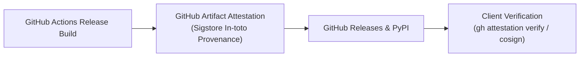

# BioNexus Release Signing & Cryptographic Provenance

## 1. Cryptographic Release Signing Architecture

**Status: designed, not verified for the current release.** The workflow intends to
use Sigstore Cosign and GitHub Artifact Attestations, but repository-local files do
not prove that a hosted workflow completed, that an artifact reached a transparency
log, or that the current release is signed. Verify each release remotely before
making that claim.



---

## 2. Two-Tier Release Distribution Architecture

To strictly balance public open-source availability with institutional data governance and privacy compliance, BioNexus release assets are strictly bifurcated into two distinct layers:

### Tier 1: Public Release Assets (GitHub Releases & PyPI)
Designed for public distribution and open reproduction:
- Python Wheel (`.whl`) and Source Distribution (`.tar.gz`)
- `SHA256SUMS.txt` manifest
- Benchmark and evaluation reports (`benchmark_report.md`, `wheel_benchmark_report.md`)
- Platform manifests (`plugin.json`, `mcp.json`, `marketplace.json`)
- CycloneDX SBOM (`sbom.json`)
- GitHub Artifact Attestation (Sigstore In-toto signed DSSE bundle)

### Tier 2: Research Evidence Package (development)
Designed for reproducibility experiments; not independently attested by default:
- `PROVENANCE.json` (execution provenance and environment locks)
- legacy local integrity fixtures (`ATTESTATION_BUNDLE.json`,
  `VERIFICATION_RECEIPT.json`, `rekor_transparency_proof.json`, and
  `tsa_timestamp_token.json`), which MUST NOT be described as Sigstore, Rekor,
  RFC 3161, independent review, or scientific endorsement
- `bionexus.evidence-attestation.v1` records only when they verify against an
  explicit trust registry, artifact digest, expiry interval, and revocation state

> [!IMPORTANT]
> **Data Privacy & Governance Rule**: Controlled institutional LIMS data, donor-level unmasked clinical matrices, and restricted PHI are strictly excluded from public distribution packages and remain protected within air-gapped or controlled-access boundaries.

---

## 3. Verifying Release Integrity

The commands below are acceptance checks for a release that actually publishes the
corresponding hosted evidence. A successful local SHA-256 check proves integrity,
not signer identity or scientific validity.

### Using GitHub CLI:
```bash
gh attestation verify dist/bionexus_reliability-1.0.0rc2-py3-none-any.whl --owner HERRY423
```

### Using Sigstore Cosign:
```bash
cosign verify-blob \
  --certificate-identity "https://github.com/HERRY423/BioNexus/.github/workflows/release.yml@refs/heads/main" \
  --certificate-oidc-issuer "https://token.actions.githubusercontent.com" \
  --bundle dist/bionexus-1.0.0-rc.2.bundle \
  dist/bionexus_reliability-1.0.0rc2-py3-none-any.whl
```

### Using Local SHA-256 Manifest:
```bash
sha256sum -c dist/SHA256SUMS.txt
```
