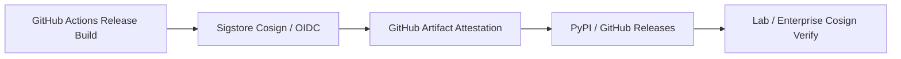

# BioNexus Release Signing & Sigstore Provenance

## 1. Cryptographic Release Signing Architecture

All official releases and container images of BioNexus are signed using [Sigstore Cosign](https://www.sigstore.dev/) and GitHub Artifact Attestations to provide keyless, tamper-evident cryptographic provenance.



---

## 2. Verifying Release Integrity

To verify the cryptographic authenticity and provenance of a BioNexus wheel or tarball release:

### Using GitHub CLI:
```bash
gh attestation verify bionexus_reliability-0.10.0-py3-none-any.whl --owner HERRY423
```

### Using Sigstore Cosign:
```bash
cosign verify-blob \
  --certificate-identity "https://github.com/HERRY423/BioNexus/.github/workflows/release.yml@refs/heads/main" \
  --certificate-oidc-issuer "https://token.actions.githubusercontent.com" \
  --bundle bionexus-0.10.0.bundle \
  dist/bionexus_reliability-0.10.0-py3-none-any.whl
```

---

## 3. SHA-256 Checksums

Every release asset on GitHub Releases is accompanied by a `SHA256SUMS` manifest signed by the release pipeline.
