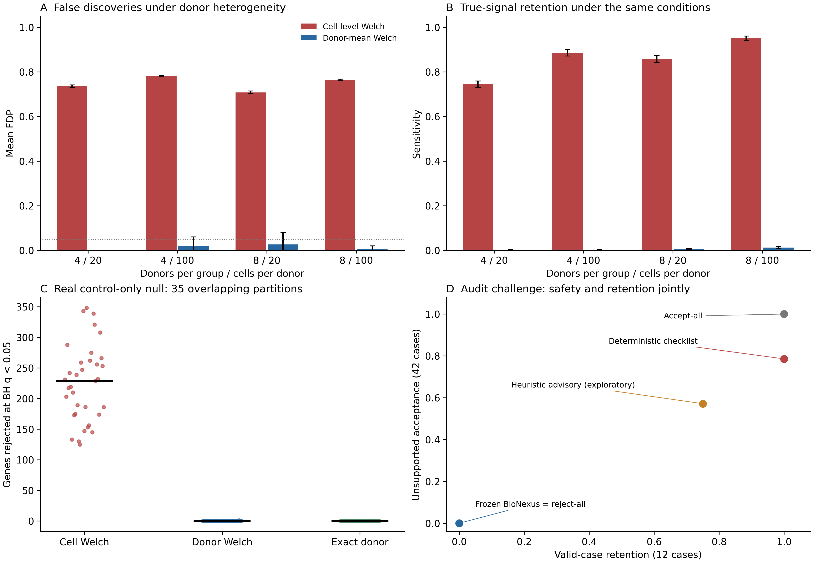
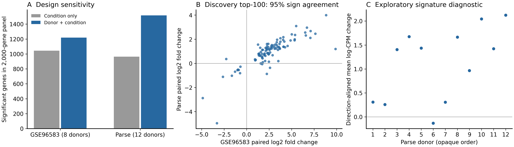

# BioNexus 方法学实验：实际完成结果与投稿边界

**结论：本轮已完成本地可执行的统计对照、真实数据重分析、审计挑战和机制消融。当前数据不支持“BioNexus 已实现低错误率且保留有效结论”的产品优越性主张。** 实验最有价值的发现是把下一步缺口定位为可复现的具体失败机制，而不是再增加抽象规范。

受测对象是 `bdf38e1942ff4f517ae696c3c413bf481d8ebac4` 加当时尚未提交的本地改动，实际导入冻结副本；不是公开 rc.5 发布包、不是未见数据上的外部评测。冻结时间：2026-09-08T13:47:42.208804+00:00。原始代码、输入、协议和执行器均有 SHA-256 记录。原始结果未被修复覆盖。

## 1. 完成了哪些真正的实验

| 实验 | 实际执行量 | 核心结果 | 能支持的结论 |
|---|---:|---|---|
| 已知真值模拟 | 800 数据集、1,600 次方法评估、320,000 条基因结果 | 存在供体异质性时，细胞检验的平均 FDP 为 70.8%–78.1%（有信号各层）；供体均值检验约 0%–2.7% | 统计单位错误确有严重后果；不能把它当 BioNexus 的独有创新 |
| 真实对照组空效应分组 | 2,155 个对照 CD14+ 单核细胞、8 供体、1,000 基因、35 种独特分组 | 细胞检验 35/35 有发现，中位 229 基因；供体 Welch 为 1/35；精确供体检验为 0/35 | 忽略供体可在人工分组中产生大量发现；35 个分组不是独立研究 |
| 两队列配对模型 | GSE96583 8 供体和 Parse 12 供体；共同 2,000 基因；4 个 PyDESeq2 模型 | 加入供体后显著基因数分别 1,044→1,219、964→1,516 | 模型设计会实质改变结果；更多显著基因不等于更真实 |
| 实际结果审计挑战 | 18 错误/正确家族 × 3 改写 × 6 对照臂 = 324 次判定 | 原始 BioNexus 错误案例放行 0/42，但有效案例保留 **0/12** | “全部拦住”不能证明净收益 |
| 事后机制消融 | 同一 54 案例 × 2 实验臂 = 108 次判定 | 仅将极小 P 值提示降为建议：有效保留 **9/12**，错误放行 **24/42** | 放宽启发式会暴露更深的绑定与陈述核对缺口 |

模拟每层仅 50 个随机种子，区间是 Monte Carlo 不确定性，不能外推真实研究分布。尤其在供体异质性为 0.8 时，供体均值 Welch 的真信号敏感度只有 0.1%–1.25%；它的低 FDP 部分伴随很大功效代价。论文必须同时展示错误率和有用结论保留。无供体异质性的条件是同样保留的阳性控制，见全量 CSV，不能只挑最有利的场景。

## 2. 哪些失败最影响投稿

**极小 P 值启发式造成有效结果误拦。** 实际供体配对 PyDESeq2 表含 18 个 P<1e-100 的基因、没有 P=0。BFA-001c 对所有案例给出高影响问题，掩盖了其他机制是否工作。报告文字虽然说不能仅凭小 P 值否定供体结果，执行状态却确实阻止了通过。

**“执行绑定已核查”并不等于执行绑定真的成立。** 错误结果哈希、结果被改动、fit_status=FAILED、公式与实际设计矩阵冲突四个家族共 12/12 个案例仍被标为 `analysis_execution_binding=ASSESSED`。首轮顶层拒绝源于无关的小 P 值提示，不是成功识别这些破坏。不能据此声称有真实 artifact-binding 消融证据。

**具体结果陈述尚未与表格核对。** 不存在的基因、未显著基因被声称显著、显著基因被否定、全表被错误写成零显著等案例，定向声明检查仍给出 ASSESSED。相反，实际正效应的 IL1RN “upregulated”陈述被解析为因果请求而拒绝；错误的“downregulated”也以因果问题被拒绝，不能算正确核对了方向。

**配对关系尚未贯穿现有包装器。** 受测 `scrna_deseq.py` 的实际模型为 `~ condition`。本轮使用官方 PyDESeq2 直接拟合 `~ donor + condition` 作诊断比较，未冒充包装器已经修复。两个 GSE96583 模型都记录了离散度趋势拟合切换到均值趋势的警告，未隐去。

`case-outcomes.csv` 原始字段 `issue_identified` 表示机械高风险/拒绝标志，**不能用作正确定位准确率**：拒绝所有的边界对照也会有该标志。正确定位应读取每案例具体规则与证据；原始检查级结果已另存 `original-check-localization.csv`。没有给不存在的基因检查、哈希检查或人类判断补造成功标签。

## 3. 正向结果应该如何写

在预先限定的 2,000 个共同高丰度基因中，GSE96583 配对模型的前 100 个基因在 Parse 中有 **95%** 方向一致。Parse 的 12 个供体方向对齐签名分数，4,096 种符号翻转的双侧诊断 p=**0.0009765625**。这是两个已经使用过的公开数据集上的探索性一致性，基因筛选还用到了两队列的丰度信息；不是独立盲法验证，不能替换旧的预注册端点或其阴性结果。

Parse 输入来自此前 725,031 个细胞的聚合；本轮实际读入的是 24 行 pseudobulk，没有重新下载并重算 725,031 个细胞。原提取记录中的 **30,634 个细胞元数据/表达条目数量差异**及 PASS_WITH_RETAINED_SOURCE_METADATA_COUNT_DISCREPANCIES 状态保留。两队列都是混合 PBMC，细胞组成变化不能被本轮结果排除。签名诊断使用 2,000 基因面板内的 library normalization，符号翻转还依赖零假设下供体分数的符号可交换性。

## 4. 下一步只应收敛到一个可证伪承诺

> 对已完成的多供体差异表达分析，BioNexus 核验声明引用的基因、比较方向、显著性与实际执行证据；证据不能闭合时明确返回未评估，并让科学负责人裁决。本轮尚未证明其优于常规审阅或可节省实验室时间。

优先顺序：① 真正核验结果/counts/样本表/设计矩阵和拟合状态的绑定；② 表格字段与逐条陈述核对、正确处理否定与范围；③ 在这些证据核验成立后降低小 P 值启发式的误拦；④ 支持实际配对模型与不可辨识设计检查；⑤ 冻结修复版本并在外部未见任务上比较真实 LLM/清单/人工流程。这些失败例可作为回归集，但回归通过不再算独立确认实验。

## 5. 已交付和不能声称完成的部分

已有 `PROTOCOL.md`、`FREEZE.json`、冻结源码、完整随机种子与基因级结果、四个模型的矩阵/结果/回执、54 个逐案输入和审计输出、消融结果、两张 PNG/PDF/SVG 图、英文方法与结果补充材料、盲评交接包和空白时间记录表。第二次独立本地执行的 **14 个 CSV 文件逐字节一致**，BH 与精确置换分别通过 SciPy 对照核验。

真实模型四臂比较 **NOT_RUN**（无配置 API 凭据）；外部专家评审、实验室净收益、盲法外部复制 **NOT_ESTABLISHED**。没有联系外部人员，没有投稿、发布或改写公开认证。这些实验推进了计算证据和缺陷定位，**尚未补齐 SCI 一区方法学论文的全部主要缺口**。

复现：在原仓库、冻结依赖版本环境运行 `python review/methods-experiments-2026-09-08/run_experiments.py <stage> --run-id <新的目录名>`；stage 为 simulate / real-null / paired / challenge，challenge 的 `--real-run-id` 指向已有 paired 结果目录。既有目录会拒绝覆盖。数据来源和位置见 FREEZE.json；原始两数据文件必须可用且哈希一致。这是本地可复现证明，尚无跨机器重现结论。
