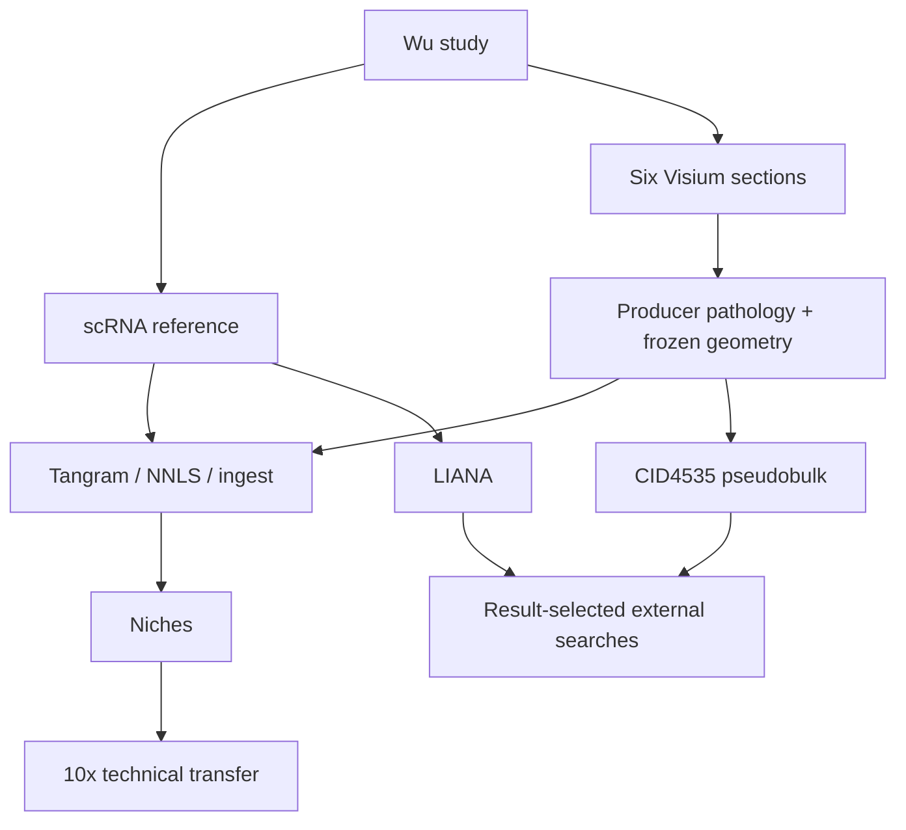

# Provenance and dependence

Local Python/scverse execution. Workbench contributes data understanding/design/catalog routing, Literature and Databases supply external query returns, and BioNexus passively audits supplied records. None supplies independent biological replication.
